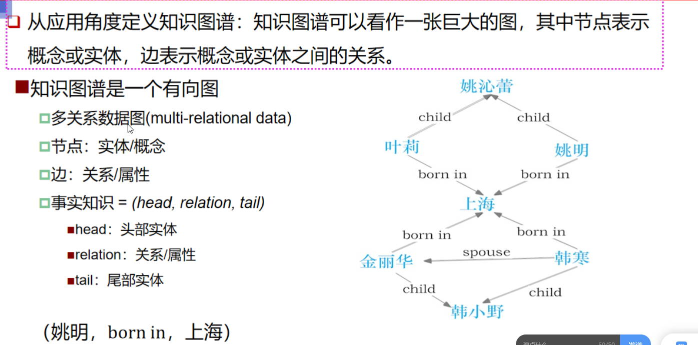
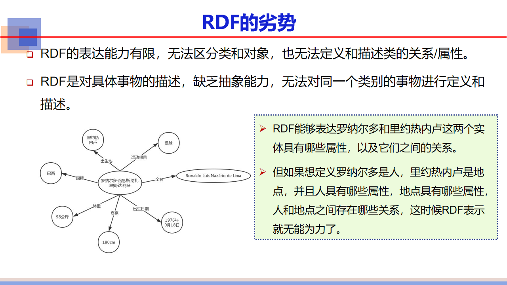
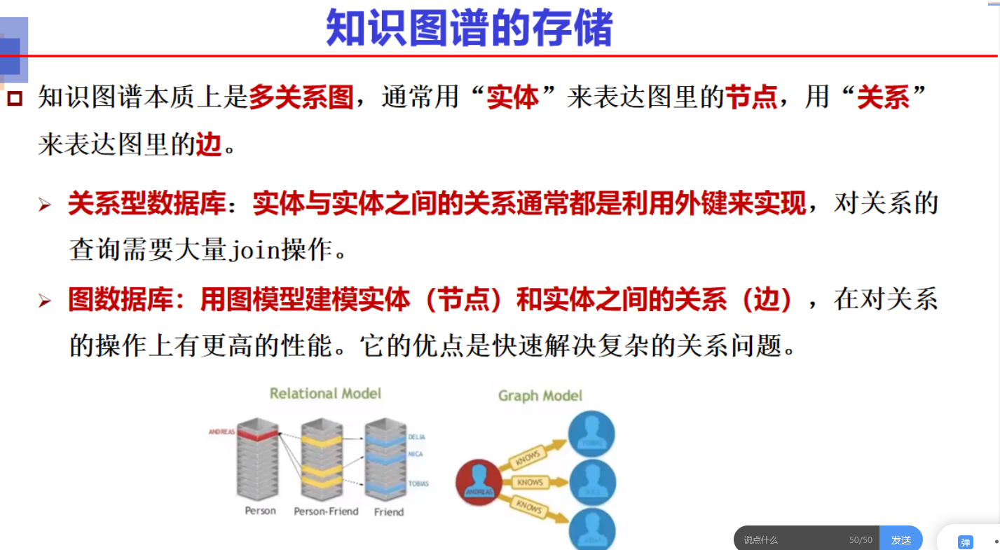
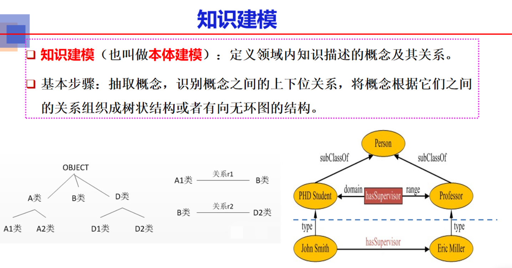

# 本节内容

# 传统搜索引擎原理

# 什么是知识图谱

## 知识图谱定义

### 学术角度定义

### 应用角度定义

 

#### 例子

SubClassOf：子类

## 人工智能为什么需要知识图谱

# 知识图谱产生背景

## 语义网络

### 本体知识表示法

#### 本体的定义

**最抽象的概念的详细的说明**

#### 本体的特性

#### 本体的组成

#### 例子

## 万维网

### 定义、诞生

### 特点

## 语义web

### 实现语义网需要解决的问题

### 语义网的只是表示技术

#### XML

#### RDF

##### RDF的缺陷

#### RDFS

#### OWL

#### 链接数据

# 典型的知识图谱

## 知识图谱的分类

## CYC

## WordNet

## DBpedia

## Freebase\Wikidata

## YAGO

## 中文知识图谱CN-DBpedia

# 如何构建一个知识图谱

## 知识图谱的存储

## 图数据库

## 构建知识图谱实例

# 知识图谱的生命周期

# 知识图谱的构建流程

## 知识建模

### 为什么要做只是建模

### 知识建模的方法

### 典型知识图谱概念体系的现状

### 知识建模的实例

## 获取知识的途径

半结构化数据

### 如何从文本中获取实体

### 实体识别

#### 实体识别与抽取

#### 实体消歧

### 关系抽取

#### 关系抽取的分类方法

##### 基于规则的方法进行关系抽取

## 知识图谱推理的方法

### 基于逻辑的推理

### 基于关系的推理

### 基于图的推理

### 基于深度学习的推理

### 小结

## 知识融合

# 知识图谱技术总结

# 知识图谱的应用

