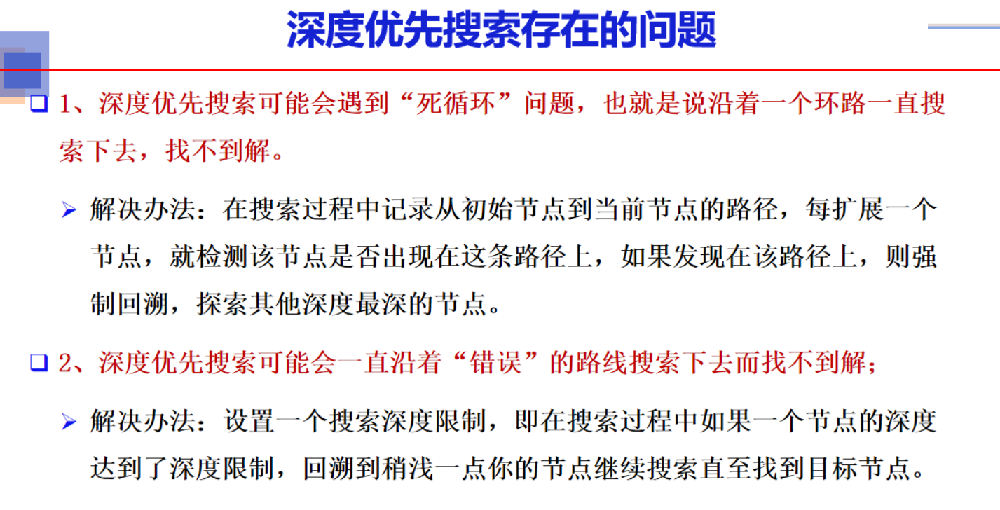

# 本课目标

# 5.1引言

## 例子1

## 例子2

## 状态空间的图描述

# 5.2图搜索策略

## 图搜索策略

## 图搜索的分类

# 5.3盲目搜索

## 深度优先搜索

## 4皇后问题

## 深度搜索的问题

# 5.3宽度优先搜索

# 5.4启发式搜索

## 启发信息

## 启发式搜索

### 耗散值

## A算法的基本特点

## A算法求解八数码问题

## 启发函数的优劣

## A算法的实现过程

## A*算法

### 欧式距离例子

### 例子

### 例子2

# 博弈搜索

