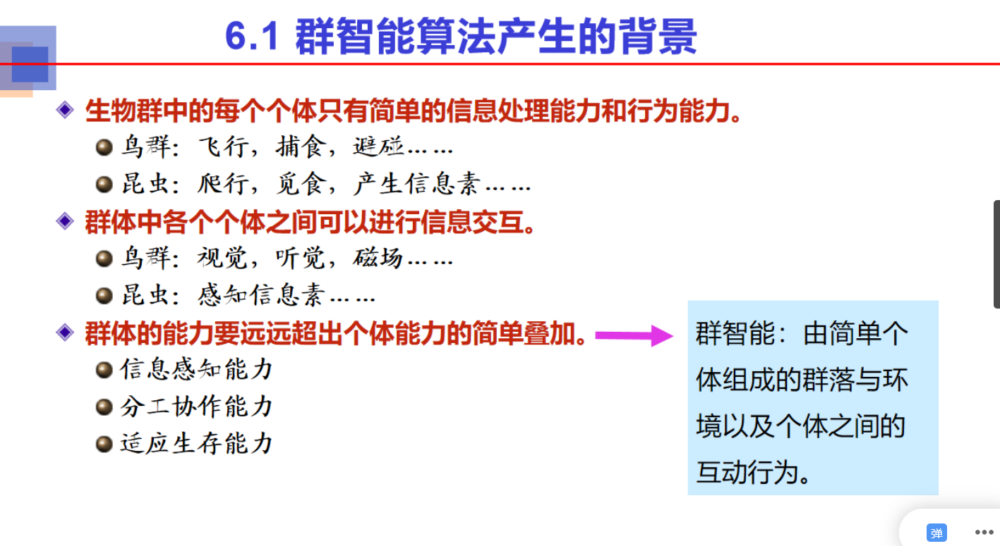

# 6.1 群智能算法产生的背景

# 6.2 遗传算法

## 遗传算法

## 遗传算法的生物学基础

## 遗传算法的提出

## 遗传算法的基本思想

### 遗传算法与生物进化的比较

### 基本思想

## 遗传算法设计的基本内容

### 编码机制

#### 二进制编码

#### 其他编码机制

### 群体设定

### 适应度函数

### 个体选择

#### 个体选择概率分配方法

#### 选择个体的方法

### 交叉

### 变异

## 遗传算法的基本流程

## 遗传算法的步骤

## 遗传算法的实例

