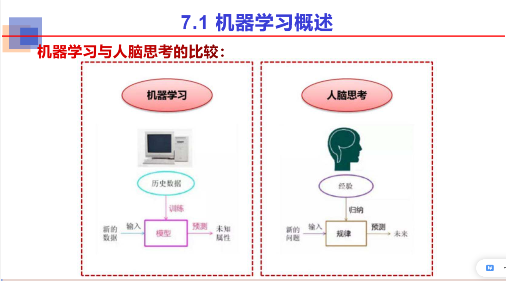
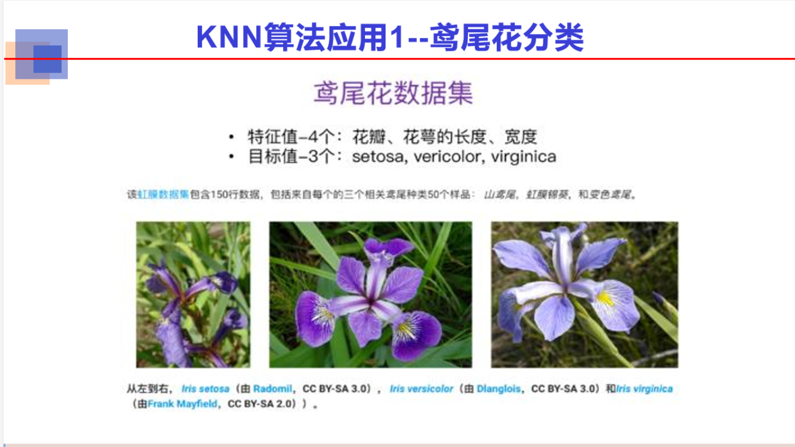
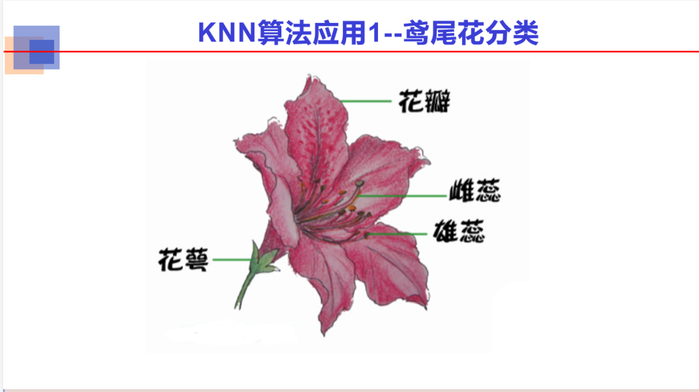

# 7.1 机器学习概述

## 机器学习的基本概念

## 机器学习的分类

# 7.2 监督学习

## 7.2.1 KNN算法

### KNN算法——鸢尾花分类

## 7.2.2 决策树

### 定义

### 决策树与if-else的区别

### 评价

### 如何构建一颗决策树

#### 纯度

#### 信息熵

#### 信息增益

### 停止条件

### 例子1

### 例子2

### 决策树分类算法

### 决策树分类方法的优点

### 决策树分类方法的缺点

### 决策树分类方法的应用

## 7.2.3 支持向量机

### 实例1

