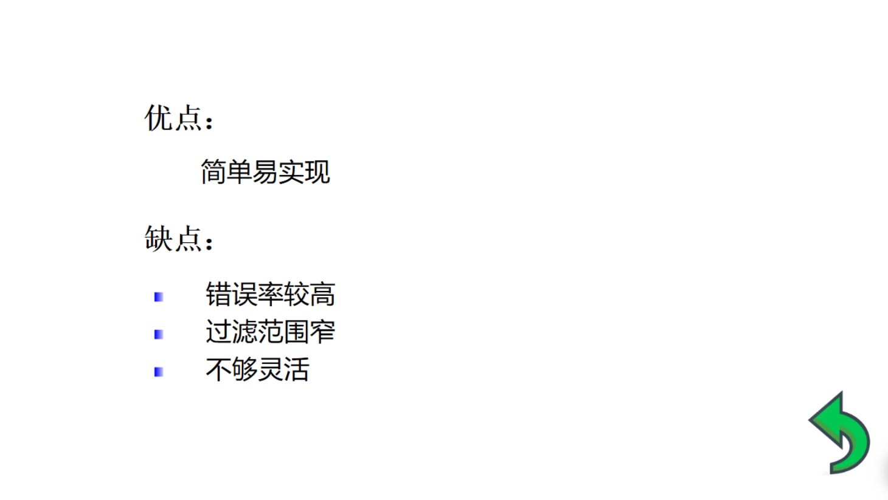
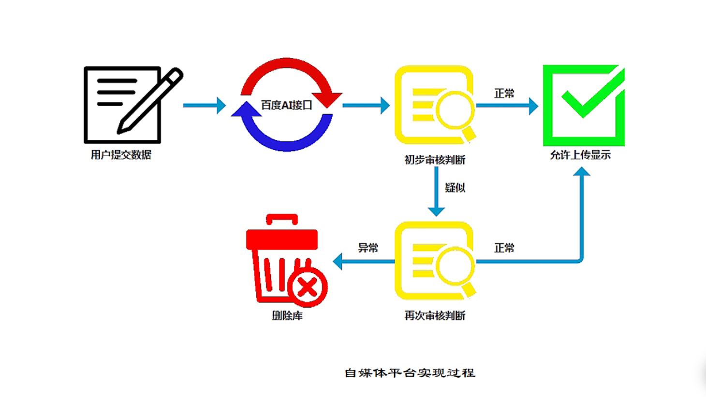
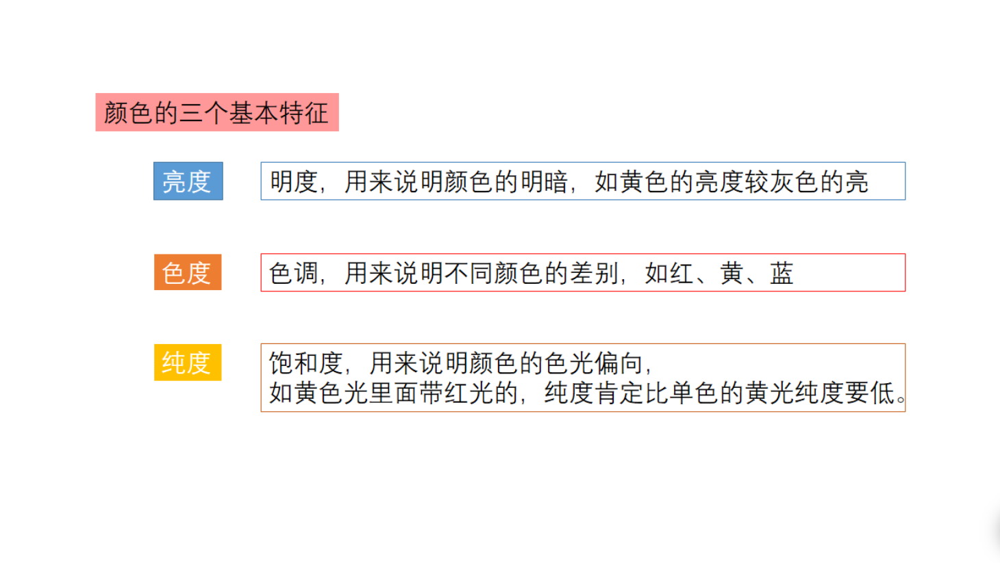
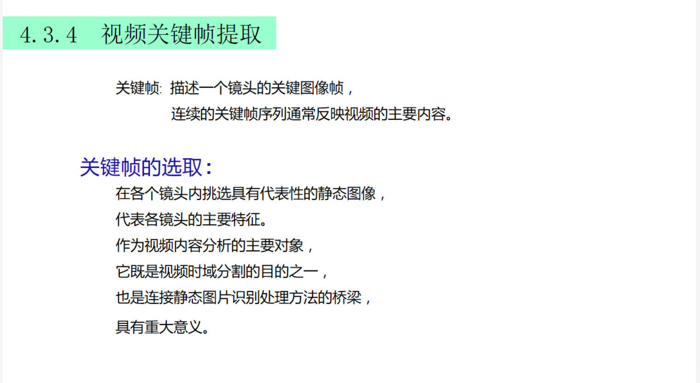
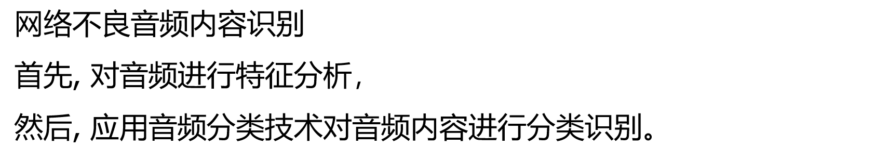
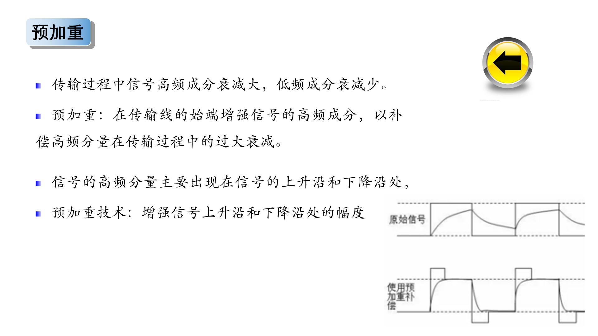
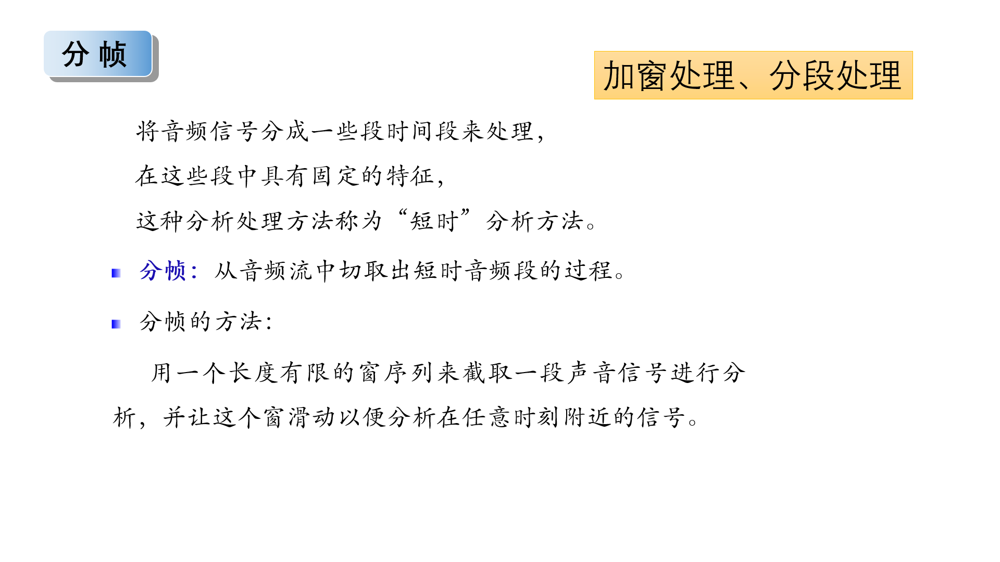
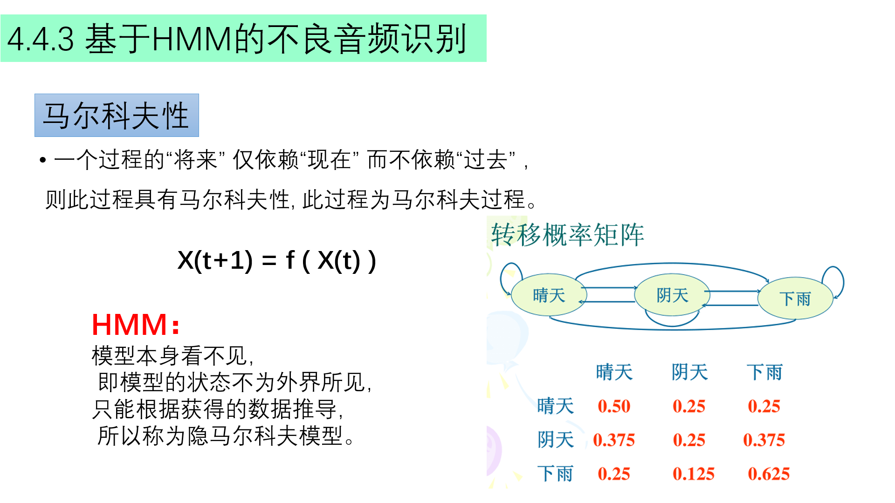

# 4.1概述

## (1)网络多媒体信息现状

## (2)网络不良多媒体过滤方法

### 1、基于分级标注的过滤

### 2、基于URL的过滤

### 3、基于关键词的过滤

### 4、基于内容分析的过滤

# 4.2 网络不良图像内容识别

## (1)不良图像内容识别现状

## (2)不良图像内容识别技术

## 4.2.1 肤色检测

## 4.2.2 文理分析

## 人工智能十大算法

## 4.2.4 不良图像识别

### 经验阈值法

# 4.3 网络不良视频内容识别

## 4.3.1 网路视频流的发现

## 4.3.2 网络视频流流量的获取

## 4.3.3 视频时域分割

## 4.3.4 视频关键帧提取

# 4.4 网络不良音频内容识别

## 4.4.0 相关内容

### 深度伪造

### 出现的问题

### 解决办法

### 案例

## 4.4.1 音频信号预处理

- 预加重
- 分帧

### 预加重

### 分帧

## 4.4.2 短时音频特征

- 短时平均能量
- 短时平均过零率
- 基音频率
- 子带能量率和频率质心
- MEL频率倒谱系数

### 短时平均能量

### 短时平均过零率

过零率的两类重要应用

- 粗略的描述信号的频率特征
- 判别清音和浊音、静音与非静音

### 基音频率

### 子带能量率和频率质心

### MEL频率倒谱系数

## 4.4.3 基音HMM的不良音频识别

### HMM用于语音识别

# 4.5 本章总结

