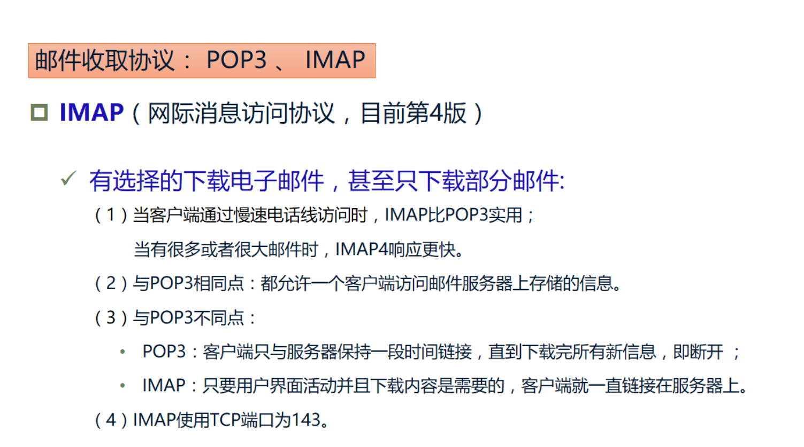

# 5.1 电子邮件概论

## 5.1.1 电子邮件通信原理

## 5.1.2 电子邮件格式标准

## 5.1.3 电子邮件传输协议

## 5.1.4 电子邮件的内容安全

# 5.2 垃圾邮件

## 5.2.1 垃圾邮件的定义

## 5.2.3 垃圾邮件的危害

# 5.3 垃圾邮件的特征提取

## 5.3.1 垃圾邮件的特征分析

## 5.3.2 垃圾邮件的预处理技术

# 5.4 垃圾邮件的过滤技术

## 5.4.1 基于黑白名单的过滤技术

## 5.4.2 基于关键字的过滤技术

## 5.4.3 基于统计的内容过滤技术

