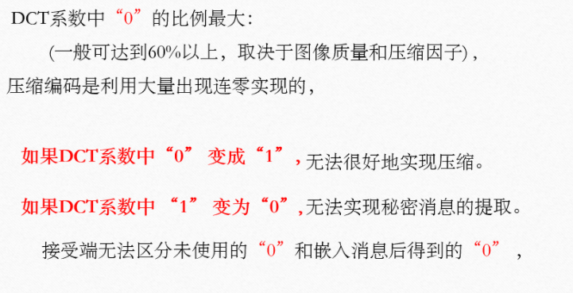
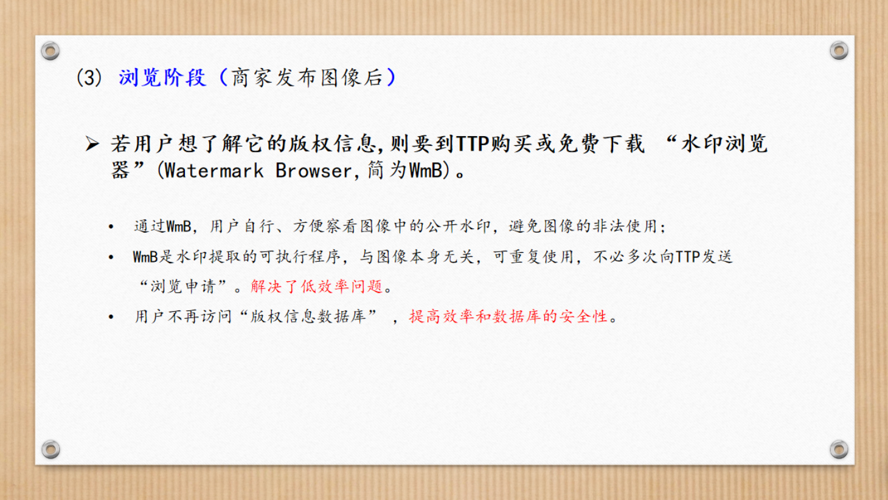
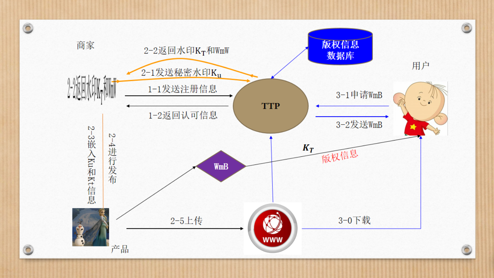
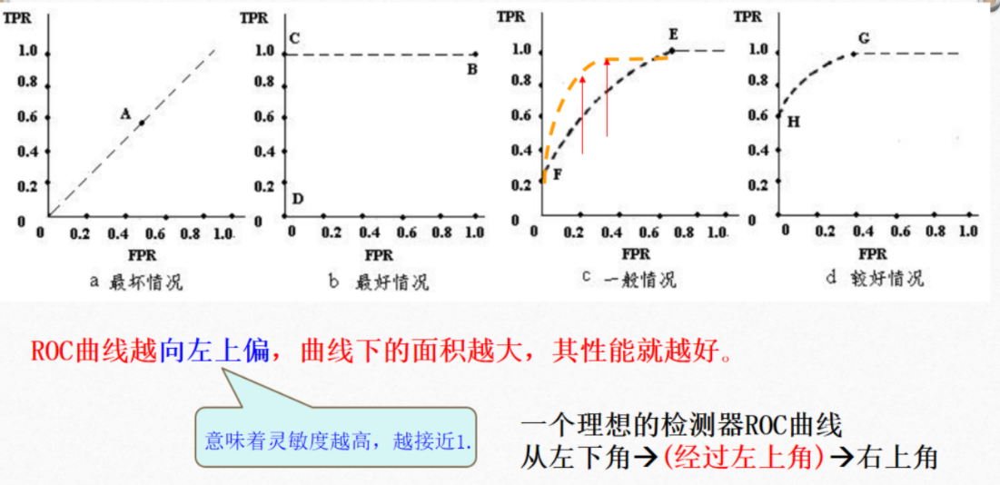
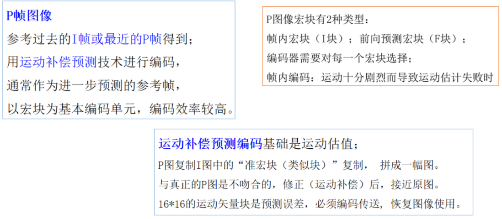
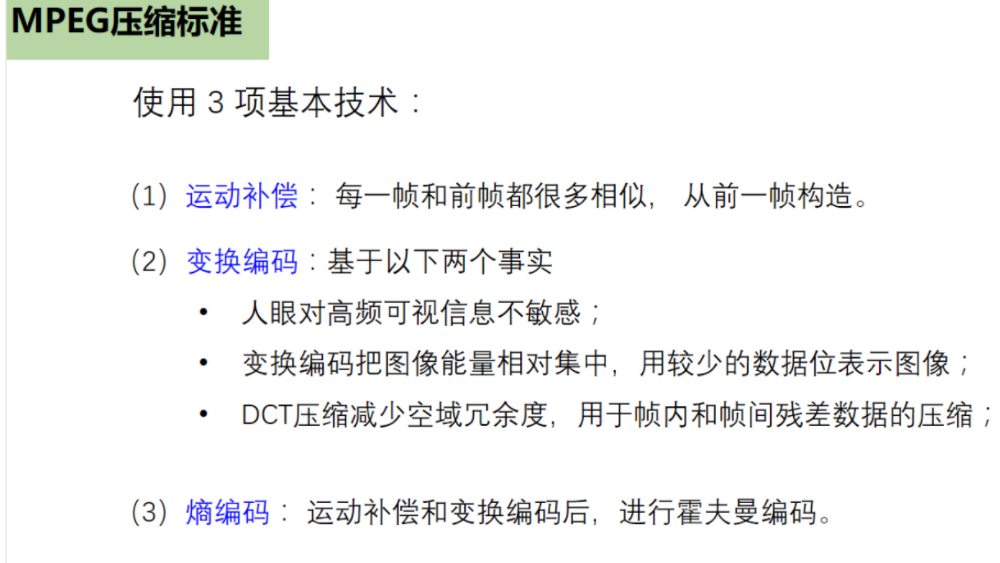
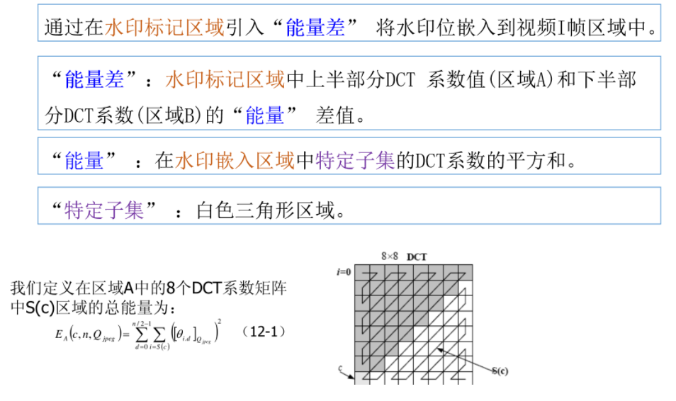

# 第一章 信息隐藏技术概论

## 信息隐藏

### 定义（重点）

把一个有意义的信息隐藏在另一个载体中得到隐蔽载体

### 信息隐藏的分类（重点）

- 载体类型：文本、图像、声音、视频
- 密钥分类：对称隐藏、公钥隐藏
- 嵌入域：空（时）域、变换域
- 提取要求：盲隐藏、非盲隐藏
- 保护对象：隐写术、数字水印

## 隐写术（重点）

### 定义

目的是在不引起任何怀疑的情况下秘密传送消息

### 主要要求

不被检测到和大容量

## 数字水印（重点）

### 定义

将一些标识信息（即数字水印）直接嵌入数字载体当中（包括多媒体、文档、软件等）或是间接表示（修改特定区域的结构）。

不影响原载体的使用价值，也不容易被探知和再次修改

### 目的

进行版权保护、所有权证明、指纹（追踪发布多份拷贝）和完整性保护等

### 主要要求

鲁棒性和不可感知性

## 信息隐藏的技术分类

## 信息隐藏的技术特点

**透明性、鲁棒性、不可检测性、安全性、自恢复性、对称性、可纠错性**

## 信息隐藏模型

### 主要由下述两部分组成

(1)信息嵌入算法：利用密钥来实现秘密信息的隐藏

(2)隐蔽信息检测/提取算法(检测器):利用密钥从隐蔽载体中检测/恢复出秘密信息。在密钥未知的前提下，第三方很难从隐秘载体中得到或删除、甚至发现秘密信息。

## 信息隐藏算法（重点）

### 空域（LSB算法（最不重要位算法））

将信息嵌入到随机选择的图像点中最不重要的像素位（LSB）中，可保证嵌入的水印是不可见的。

**优点：可以实现高容量和较好的不可见性**

**缺点：鲁棒性差，容易被第三方发现和得到，遭到破坏，对图像的各种操作如压缩、剪切等是算法可靠性受到影响**

### 变换域（DCT域算法JSteg算法）

做法：计算图像的离散余弦变换(DCT)，将水印叠加到DCT域中幅值最大的前 k 系数上(不包括直流分量)，通常为图像的低频分量。

**优点：具有较强的鲁棒性、安全性、 透明性等。**

## 应用领域（重点）

- **数据保密**
- **数据的不可抵赖性**
- **数字作品的版权保护**
- **防伪**
- **数据的完整性**：确认数据在传输或存储过程中没有被篡改。采用脆弱水印技术，一旦数据被篡改，则会导致水印破坏，从而保证数据的完整性

# 第二章 隐秘技术与分析

## 隐写术（重点）

特点：不是无法解读消息内容，只是隐藏消息本身，即消息的存在形式。

## 密码术（重点）

专指加密算法，将普通消息转换成难以理解的资料

解密算法：由密文转换会明文

特点：密码隐藏的是内容，注重将信息变成不可解读。

## 隐写系统（重点）

## JPEG压缩编码流程图（重点）

## 变换域隐写方案

## Jsteg算法（重点）

JPEG是互联网上最为常见的图像格式，DCT变换是JPEG压缩采用的重要技术之一，在DCT变换系（DCT域）上隐藏信息是常见的数字隐写方式。

JSteg是最早在JPEG图像中进行隐写的方法之一。

### 算法隐写步骤

### 0和1不嵌入信息的原因

# 第三章 数字水印技术

## 定义（重点）

在数字化的数据内容中嵌入不明显的记号，被嵌入的记号通常是不可见或者不可察觉的，通过一些计算机操作可以被检测或被提取。

该水印信息可包含著作人身份、节目特征、设备属性等特定信息，用以实施版权识别、盗版追踪，也可以判断载体是否被篡改。

如果他人擅自去除嵌入的信息，将会严重影响信息的质量。

## 数字水印&信息隐藏

## 数字水印的特点（重点）

透明性、鲁棒性（稳健性）、安全性

### 透明性

水印后图像不能有视觉质量的下降，与原始图像对比，很难发现二者的差别；

从感官上和统计上都是不可感知的。

### 鲁棒性（稳健性）

- 数字水印应该难以被擦除，任何试图完全破坏水印的努力江都载体的质量产生严重的破坏；
- 加入图像中水印必须具有稳健性，能够承受施加于图像的变换操作，如图像的变换操作（如：加入噪声、滤波、有损压缩、重采样、D/A或A/D专换等）。

### 安全性

- 能抵抗各种蓄意的攻击；
- 能够唯一标识原始图像的相关信息；
- 任何第三方不能伪造他人的水印图像。

## 水印嵌入系统和水印回复系统

### 水印嵌入系统

### 水印恢复系统

## 分类

### 秘密水印（非盲化水印）

检测时需要原图，通过原图和检测图片的比较得到水印。

### 半私有水印

检测时不需要原图，但需要水印的拷贝来判断待测试图片中是否包含特定的水印。

### 公开水印（盲水印）

检测时不需要原图和源水印，要求能从可能已被修改的图像中提取水印。（水印的健壮性要求高，技术实现难度大，应用范围也最广）

## 其他分类方法

### 载体类型

- 文本
- 图像
- 音频
- 视频

### 水印用途

- 版权保护可见水印
- 隐藏标识水印

### 健壮性

- 鲁棒水印
- 易损水印

### 嵌入位置

- 空（时）域水印
- 变换域水印

### 检测分类

- 盲水印
- 非水印

## DCT域数字图像水印

### 优势

- 鲁棒性强
- 与常用的图像压缩标准JPEG兼容

### Koch算法

#### 特点

- 盲检测：检测过程不需要原始图像
- 块效应：尤其是平坦快和边缘块区域（其DCT交流系数数值较小，微小变化容易引起PSNR迅速下降）
- 优化和改进：根据HVS特征，考虑避开关键点区域嵌入水印

### Koch改进算法

## 人类视觉系统 HVS

## DCT域算法嵌入技术（重点）

### 嵌入位置选择

- 从不可见性考虑：将水印嵌入DCT变换域的AC高频系数

  

- 从鲁棒性考虑：将水印嵌入DCT域的DC系数或AC低频系数

  

#### 结论

选择中频系数，不可见性好，达到透明性和鲁棒性的较好折中（trade-off)

### 嵌入方式

- 非自适应性加性和乘性嵌入

  

- 基于关系的嵌入方式

  

- 自适应嵌入方式

  

  

### 检测技术

- 非自适应加性和乘性检测方法

  

- 基于关系的提取

  

## 数字水印技术应用

- 版权保护

- 盗版跟踪

- 拷贝保护

  

# 第四章 数字水印的攻击方法和对抗策略

## 数字水印的攻击

### 概念

根据不同的水印嵌入弱点，设计攻击策略和算法，以达到破坏水印信息或阻碍水印提取的目的

### 目的

在尽量不影响水印作品的使用价值情况下，破坏水印信息、阻碍水印提取或质疑水印信息的可信性。

## 数字水印的攻击方法分类

### 无意攻击（鲁棒性攻击）

水印必须对一些无意的攻击具有鲁棒性，也就是对那些能保持感官相似性的数字处理操作具备鲁棒性，常见的操作有：

- 剪切
- 亮度和对比度的修改
- 增强、模糊和其他滤波算法
- 放大、缩小和旋转
- 有损压缩，如JPEG压缩
- 在图像中加噪声

### 有意攻击

以去除水印为目的，通常假设在检测时没有原始作品

- 伪造水印的抽取

  

- 伪造的肯定检测

  

- 统计学上的水印抽取

  

- 多重水印

  

## 典型的攻击方式

- 鲁棒性攻击
- 表示攻击
- 解释攻击
- 法律攻击
- 合谋攻击

### 解释攻击

#### 目的

阻止版权所有者对所有权进行认定。

对不可见、需要原作品水印的仲裁阶段进行

原理漏洞：根据待仲裁作品与原作品的差别对水印进行仲裁

#### 过程

### 合谋攻击

#### 定义

#### 第一类合谋攻击

获得同一载体图像的5幅含不同水印的图像，并取平均值，使得检测水印失败，合谋攻击成功

#### 第二类合谋攻击&广播监控

##### 抗第二类合谋攻击

在相近的帧中嵌入同样的水印信息，在不同的帧中嵌入不同的水印信息，可以有效抵抗第二类合谋攻击

## 抗解释攻击的数字水印实施框架

### 解释攻击存在的原因

- 无法检测水印加入的先后顺序
- 仅对水印序列进行注册，没有对原作品进行注册
- 水印嵌入方案具有可逆性

### 抗解释攻击

- 引入时戳机制，确定水印嵌入的先后顺序
- 在注册水印序列的同时对原作品进行注册
- 利用单向水印嵌入方案消除水印嵌入过程中的可逆性

### 方案

- 时戳机制（引入可信的时戳服务中心TSS）
  - 缺点：较小作品可能引起大失真，大信息嵌入对水印的稳健性有一定影响
- 公证机制：注册水印序列的同时注册原作品
  - 缺点：要求对每一份原始作品注册，需要庞大的数据库和复杂的协议保证绝对安全，代价太大
- 单向水印机制：只有已知原始作品才能嵌入水印

### 抗解释攻击的非对称数字水印实施框架

#### (1)对称数字水印

#### (2)商业模式中的水印架构

#### (3)非对称数字水印的可行性方案

##### (1)注册申请阶段

##### (2)水印加入阶段

##### (3)浏览阶段

优点

#### (4)抗解释攻击水印方案

# 第五章 数字水印的评价理论和测试基准

## 影响性能的主要因素

- 嵌入信息的数量：重要参数；直接影响水印的鲁棒性；对同一种水印方法而言，嵌入的信息越多，鲁棒性越低。
- 水印嵌入强度：水印嵌入强度和水印感知性之间的折衷；增加稳健性要增加水印嵌入强度，也会增加水印的课感知性。
- 数据的尺寸大小和种类：健壮性。
- 秘密信息（如密钥）：密钥数量不直接影响到水印的可见性和稳健性，但对系统的安全期重要作用；水印算法中，密钥空间必须足够大，以使穷举攻击法失效。

## PSNR

### PSNR的优缺点

## NC

计算1对了的比例

## 可靠性评价与表示

### 健壮性对攻击强度曲线

### 健壮性对视觉质量曲线

### 攻击强度对视觉质量曲线

### 接收者操作特性曲线——ROC曲线

# 第六章 视频水印

## MPEG-1算法

### 帧内压缩算法

采用与JPEG压缩算法大致相同的方法，即基于DCT的变换编码技术，以减少空间冗余信息

### 帧间压缩算法

采用运动补偿算法、预测编码方法、以及差补法等编码方法。帧间编码技术可以减少时间冗余信息。

### 图像帧分类

#### 帧内图（intra picture,I帧）

#### 前向预测图（predicted picture，P帧）

#### 双向预测帧（iderectional picture,B帧）

### MPEG的帧序列

### MPEG解码过程

### MPEG压缩标准

## 数字视频水印要求

- 经受各种非恶意的视频处理：Photometric(光度)处理、空间去同步（几何失真）、时间去同步、视频编辑
- 实时性：视频水印的特殊要求；视频信号以较高的帧速播放才能获取视觉上的平滑效果（约25帧每秒），视频水印嵌入或检测速度应至少保持在这种速度或更快帧率。
- 共谋攻击：视频间共谋和视频内共谋。

## 数字视频水印分类

### 按外观和应用分

- 可见视频水印
- 不可见视频水印
  - 鲁棒视频水印
  - 半脆弱视频水印
  - 脆弱视频水印

### 按算法嵌入域来分

- 空间域视频水印
- 变换域视频水印
  - DFT域
  - DCT域
  - 小波域
  - 其他变换域

### 按算法模式分

- 相关性视频水印
- 非相关性视频水印
  - LSB方案
  - 量化方案
  - 基于几何关系方案
    - 变换域系数关系
    - 特征点几何关系
    - 基于分形

### 按嵌入阶段来分

## 视频水印算法实例-DEW

### 算法原理

### 水印嵌入过程

### 参数选择及流程描述

#### DEW算法的参数选择

### 算法流程描述及实验

#### 水印嵌入过程

将水印信息L中$b_j$的嵌入压缩视频码流的I帧图像

#### 水印提取过程

将水印信息L中$b_j$嵌入压缩视频码流

# 第七章 音频水印 

## 数字音频水印的特点

- 必须嵌入到宿主音频数据中
- 感知透明性
- 嵌入和检测过程要使用密钥
- 鲁棒性：MP3有损压缩、低通滤波、噪声、重采样等音频信号处理
- 实时处理：计算代价要足够小
- 不应该需要原始音频
- 水印算法最好是公开的，安全性依赖于密钥。
- 音频载体特点：考虑人类听觉系统、音频格式以及传送环境等
- 相比图像视频：音频相同时间内采样点少，可嵌入信息量少
- HAS比HVS敏感，不可感知性困难

## 数字音频水印分类

### 经典的音频信息隐藏技术

- 最不重要位方法
- 扩展频谱方法
- 相位编码
- 回声隐藏方法

### 变换域的音频信息隐藏技术

鲁棒性提升

- 傅氏变换域方法DFT
- 离散余弦变换域方法DCT
- 小波变换域

### MP3压缩域的音频信息影藏技术

## 人类听觉系统（Human Auditory System，HAS）

HAS感知特性：**响度、音高和掩蔽效应**

### 响度

即声音的强弱。

物理客观测量单位：声压单位（达因/平方厘米）或声强单位（瓦特/平方厘米）

心理主观单位：使用响度级“方（phon）”或“宋（sone）”来度量

听阈：声音弱到人儿刚刚可听见时的声音强度。

痛阈：声音强到人耳感到疼痛时的声音强度。

### 音高

客观：用频率表示音高，单位Hz。

主观：单位是“Mel（美）”。

主观音高与客观音高的关系式：
$$
Mel=1000log_2(1+f)
$$

### 掩蔽效应

一种频率的声音阻碍听觉系统感受另一种频率的声音，取决于屏蔽生音与被掩蔽声音的幅值与时域特性，分为频域掩蔽和时域掩蔽。

#### 频域掩蔽

若两个信号的频率相近，较强的信号将淹没较弱的信号。

实验证明：

低频信号可有效地掩蔽高频信号，但高频信号对低频信号的掩蔽不明显、

#### 时域掩蔽

强音和弱音同时或几乎同时出现时，强音屏蔽弱音的现象。

- 超前掩蔽：在强掩蔽声音出现前，被掩蔽声音不可听见
- 滞后掩蔽：在强掩蔽声音消失后，被掩蔽声音不可听见。

## 音频水印的算法评价标准

### 主观感知质量评测标准 MOS

MOS（Mean Opinion Score，平均观点分）：常用语主观评价指标。

### 客观感知质量评测标准

#### 听觉质量客观区分度 ODG（Objective Difference Grade）

#### 信噪比 SNR

### 鲁棒性评测标准

### 虚警率

# 第八章 数字指纹

