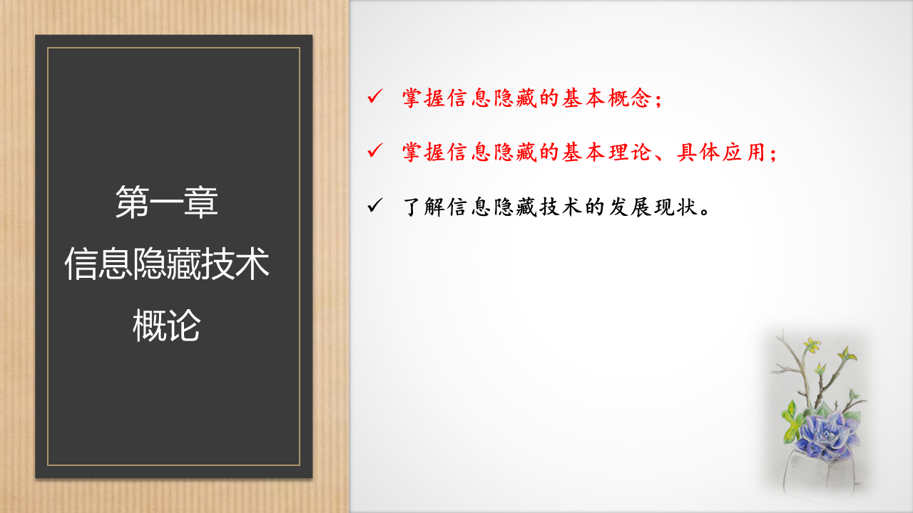
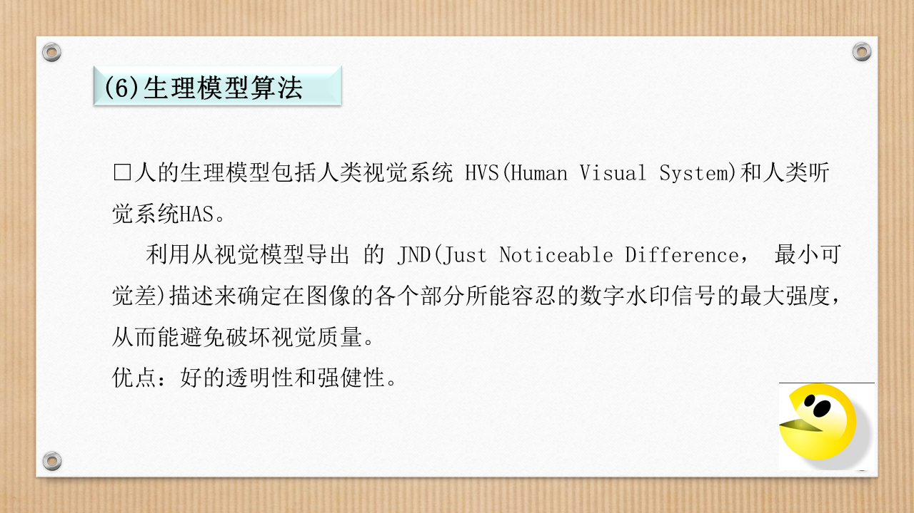

# 课程总体内容

123

# 学习目标

# 1.1信息隐藏的概念、分类及特点

## 1.1.1 信息隐藏的概念

### **信息隐藏：**

把一个有意义的信息隐藏在另一个载体C(Cover)的信息中得到隐蔽载体(Stego Cover)S。

## 1.1.2信息隐藏的分类

### 隐写术

### 数字水印

### 信息隐藏的技术分类

## 1.1.3信息隐藏的技术特点

- 透明性****
- **鲁棒性**
- **不可检测性**
- **安全性**
- **自恢复性**
- **对称性**
- **可就错性**

# 1.2信息隐藏的模型

# 1.3信息隐藏算法

## (1)空域算法

### LSB算法

## (2)Patchwork算法

## (3)频域算法

### DCT域算法

## (4)压缩域算法

## (5)NEC算法

## (6)生理模型算法

# 1.4 信息隐藏技术的发展

## (1)传统信息隐藏技术的发展

### 卡登格子隐藏法

### 藏头诗

## (2)数字信息隐藏技术的发展

# 1.5信息隐藏技术的应用领域

