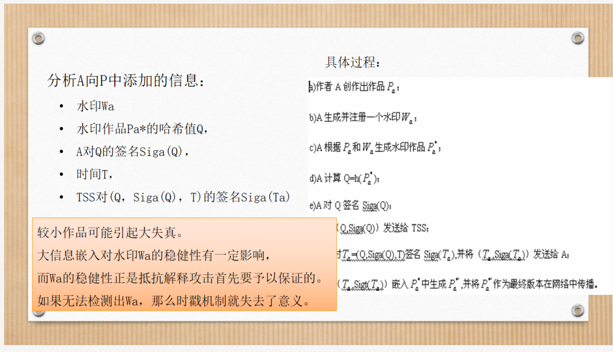
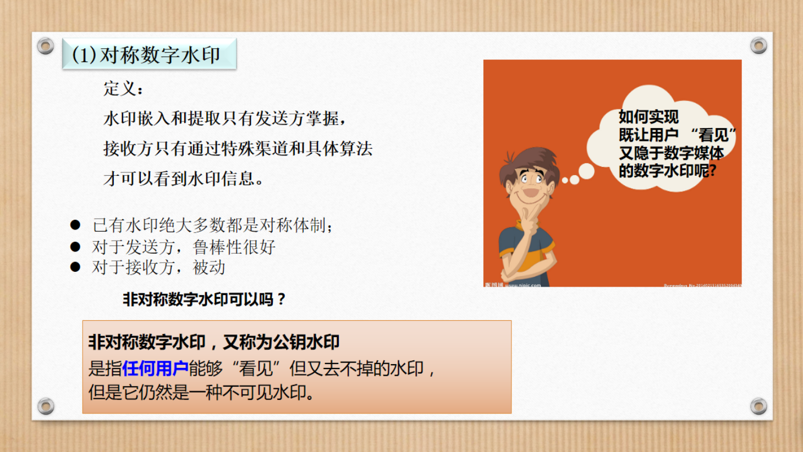
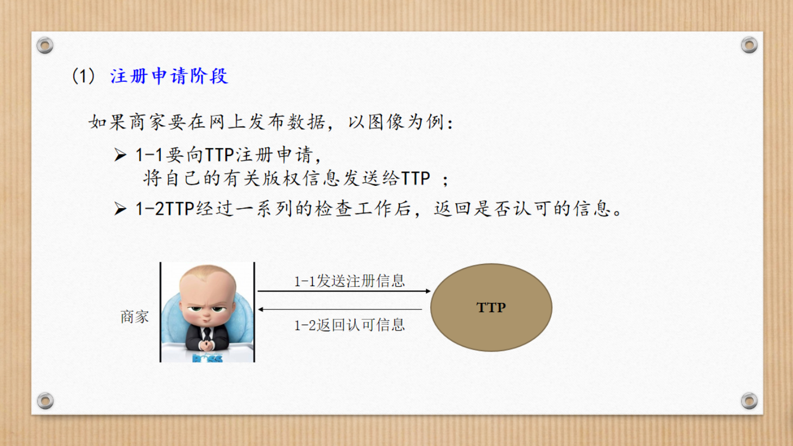
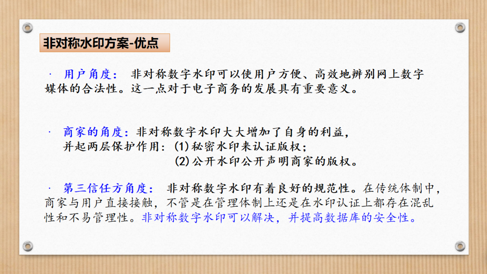
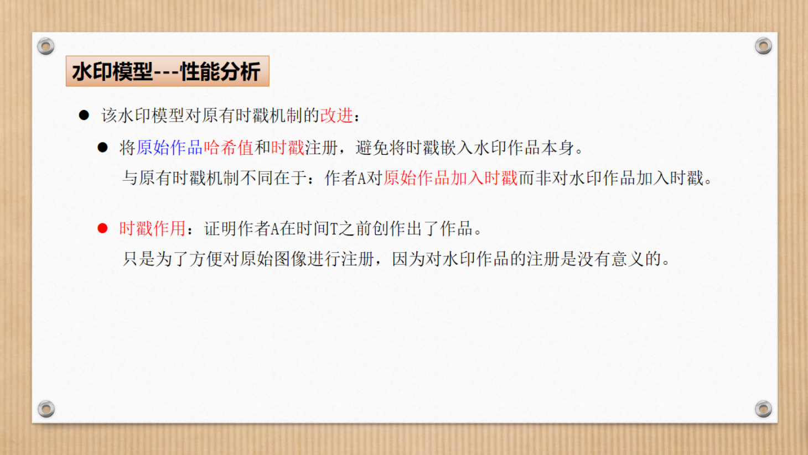

# 数字水印攻击

# 4.1数字水印的攻击方法

## 4.1.0 攻击对手猜测

### (1)攻击者一无所知

### (2)攻击者拥有多幅的含水印作品

### (3)攻击者知道算法

## 4.1.1攻击方法分类

### (1)无意攻击（≈鲁棒性攻击）

#### 马赛克攻击

噪声攻击

#### JPEG压缩

#### 模糊处理

#### 旋转、剪切

### (2)有意攻击

## 4.1.2应用中的典型攻击方式

### (1)鲁棒性攻击

#### 常见的鲁棒性攻击

### (2)表示攻击

#### 几何变换攻击

### (3)解释攻击

#### 解释攻击的必要条件

### (4)法律攻击

# 4.2典型的攻击方式-解释攻击

## 4.2.1解释攻击

### (1)水印仲裁

W`和水印相关的特征值

### (2)解释攻击

## 4.2.2抗解释攻击

### (1)解释攻击存在的原因

### (2)抗解释攻击

#### (1)时间戳机制

#### (2)公证机制

#### (3)单向水印机制

# 4.3抗解释攻击的非对称数字水印实施框架

## (1)对称数字水印

## (2)商业模式中的水印架构

## (3)非对称数字水印的可行性方案

### (1)注册申请阶段

### (2)水印加入阶段

### (3)浏览阶段

### 优点

## (4)抗解释攻击水印方案

# 4.4合谋攻击

# 4.5通知-移除制度

