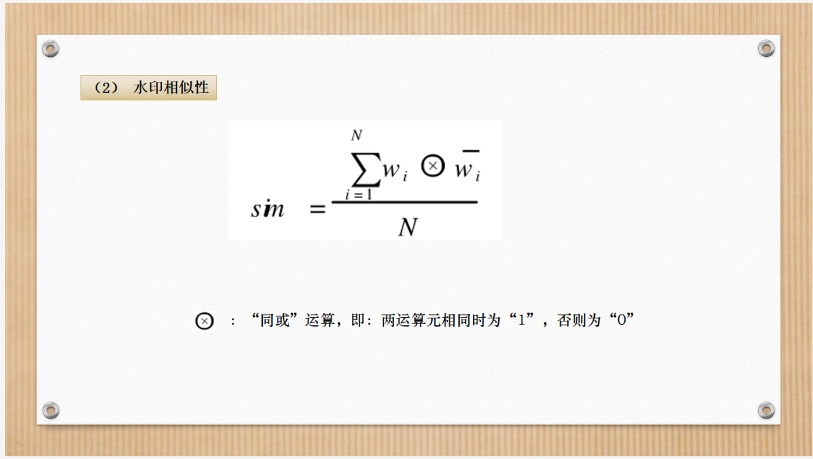
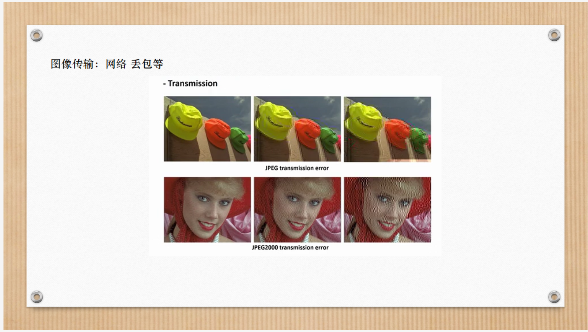
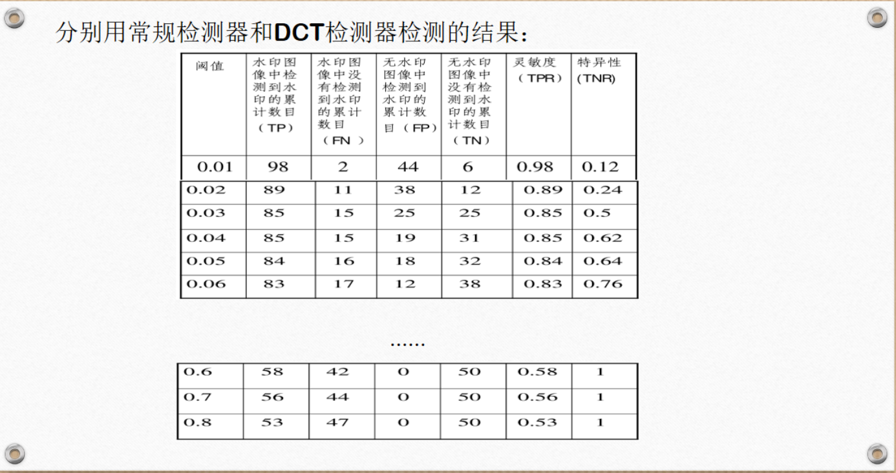
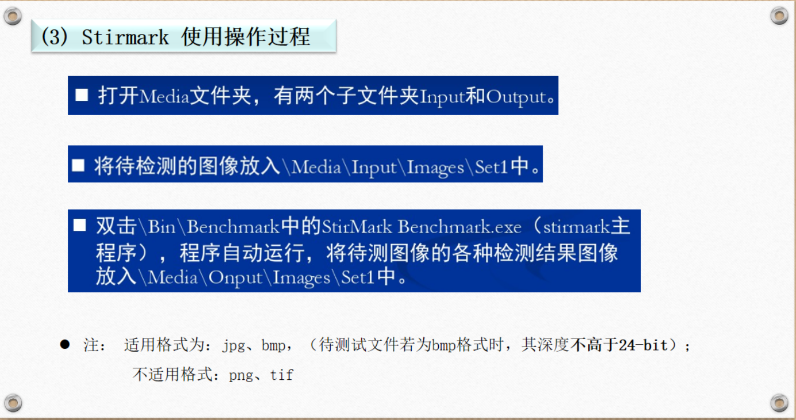

# 本章重点

# 5.1 性能评价理论和表示

## 5.1.1 评测的对象

### 1、数字水印的主要作用

### 2、影响性能的主要因素

## 视觉质量度量

hvs人类视觉系统（human view system）

## 5.1.2 基于像素的视觉质量度量

### 峰值信噪比 PSNR 均方误差MSE

### 归一化相关系数 NC

### 水印相似性 sim

### PSNR 的优缺点

## 5.1.3 与HVS相适应的感知质量度量

## 5.1.0 图像质量评估学术最新进展（补充）

## 图像质量评估方法应用现状

## 5.1.4 可靠性评价与表示

### 1、健壮性对攻击强度曲线

### 2、健壮性对视觉质量曲线

### 3、攻击强度对视觉质量曲线

### 4、接收者操作特性曲线——ROC曲线

### 实例——绘制ROC曲线

#### 1、构造样本空间

#### 2、过程

## 5.1.5 其他评价指标

# 5.2 水印测试基准程序

## 5.2.1 Stirmark

## 5.2.2 Checkmark

## 5.2.3 Optimark

## 5.2.4 测试图像

