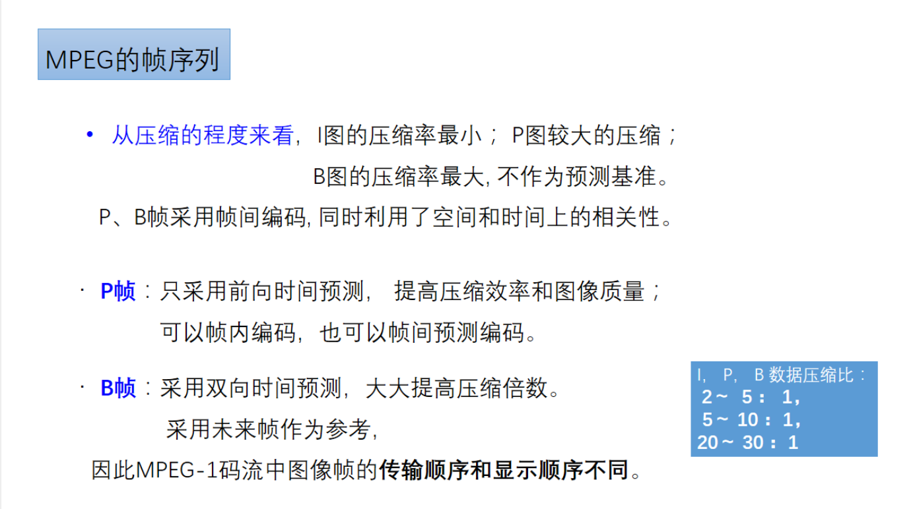

# 6.1 概论

## 视频水印概述

## 视频指纹

# 6.2数字视频的特点

## 6.2.1 视频信息的编码

## 视频压缩标准分类

### ISO/IEC标准

### ITU标准

### MPEG压缩标准

### MPEG-1采用两种压缩算法

- 帧内压缩算法
- 帧间压缩算法

### 1、帧内图（I帧）

### 2、前向预测图（P帧）

#### 运动估计

### 3、双向预测图（B帧）

### MPEG的帧序列

### MPEG解码过程

## 补充：H.265（HEVC）

## 6.2.2 视频信息的时空掩蔽效应

# 6.3数字水印视频

## 视频水印的问题和挑战

### 1、经受各种非恶意的视频处理

### 2、实时性

### 3、共谋共计

## 分类

