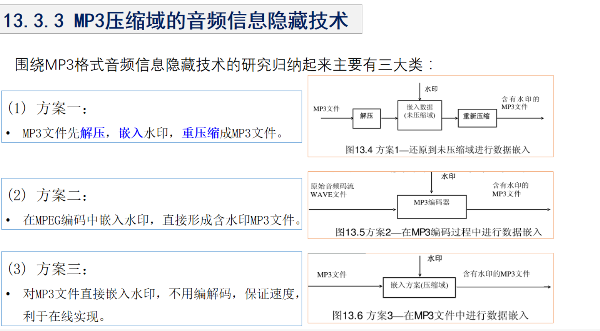

# 7.1音频水印的特点

## 7.1.1 人类听觉系统(HAS:Human Auditory System)

### 1、响度

### 2、音高

### 3、掩蔽效应

## 7.1.2 音频文件格式

### 采样频率

### 量化精度

### 编码

### 压缩

# 7.2音频水印算法评价指标

## 7.2.1 感知质量评测标准

### 1、主观感知质量评测标准

### 2、客观感知质量评测标准

#### 听觉质量客观区分度 ODG

#### 信噪比 SNR

## 7.2.2 鲁棒性评测标准

## 7.2.3 虚警率

# 7.3 音频水印分类及比较

## 7.3.1 经典的音频信息隐藏技术

### 1、最不重要位方法(LSB)

### 2、扩展频谱方法

### 3、相位编码

### 4、回声隐藏方法

## 7.3.2 变换域的音频信息隐藏技术

## 7.3.3 MP3压缩域的音频信息隐藏技术

## 7.4 DCT域分段自适应音频水印算法实例

### 7.4.1声音段分类方法

### 7.4.2 水印嵌入

### 7.4.3 水印检测

### 7.4.4 仿真结果

