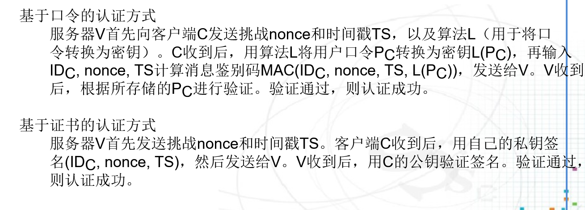

# 身份认证的目的

## 主要目的

- Alice向Bob证明“Alice是Alice”
- Bob不能利用所获得的Alice的证明，向其他人证明“Bob是Alice”
- 其他人，如Eve，不能发起中间人攻击，向Bob证明“Eve是Alice”
- 其他人，如Eve，不能利用所截获的Alice和Bob的通信内容，向其他人证明“Eve是Alice”

# 基本流程

## 认证的功能

- 确保用户身份的真实、合法和唯一
- 访问系统的第一道关口
- 访问控制的实施基础
- 其他安全措施的基础

## 参与者

- 参与方：声明者和验证者，有时还需要可信第三方
- 声明者：指声明某个身份的用户
- 验证者：验证声明者所声明身份的正确性和合法性
- 可信第三方：某些公共参数的确定

## 基本流程

- 声明者向验证者声明一个用户身份标识，请求进行身份认证
- 声明者向验证者显示能够证明该声明身份的证据
- 验证者验证该证据是否能够证明所声明的身份标识，若正确，则通过声明者的身份认证；否则，则拒绝声明者

## 身份认证协议

- 完成身份认证流程的协议
- 单向身份认证协议：Alice验证Bob，Bob不验证Alice
- 双向身份认证协议：Alice验证Bob，Bob验证Alice；相当于执行两次单向身份认证协议

# 基本方法

## 基本思想

基于用户的一些独一无二的特征来识别用户的身份，这个特征必须是只有真正的用户才知道的，或者是其他用户难以伪造的

## 分类

- 基于用户所知道的秘密
- 基于用户所拥有的凭证
- 基于用户本身的特征
- 基于用户所知道的秘密

## 基于用户所知道的秘密

- 用户名/口令：用户密码是由用户自主设定的，当用户访问系统是，输入正确的用户名密码，则系统认为是合法的用户。在这一过程中，需要用密码学的方法解决密码口令传输和存储的安全问题。

- 用户名/口令认证的缺点：

  - 口令复杂，难以记忆；口令简单，容易破解；用户体验差
  - 口令容易泄露：键盘记录木马
  - 口令传输不安全
  - 口令存储不安全

- 用户名/口令安全存储

- 用户名/口令加盐存储

  [加盐]: https://cloud.tencent.com/developer/article/1636075

  

  - 

- 动态口令：用户密码口令由系统动态生成，当用户访问系统是，输入该动态口令，则系统认为是合法用户。动态口令需要用户持有一个用于产生动态口令的设备，如口令卡、手机短信等形式保证系统与用户之间口令的一致性。动态口令解决了口令猜测、通信窃取、口令重放等安全问题。

### 动态口令的实现方式

#### 基于时间同步机制的动态口令

用户持有一个令牌卡，里边装有微处理器芯片、时钟、电源等。以时间为变量，使用对称密码算法进行运算，得到一个伪随机数明显示在令牌卡的液晶屏上，即为动态口令。用户将该口令输入系统后，传送给认证服务器，认证服务器使用相同的密钥和算法，对同一时间进行加密，得到相同的结果，则认证通过。这种方式要求客户端和服务器的时间要严格同步。

#### 基于事件同步机制的动态口令

对初始口令进行变换，执行n次单向函数，用户每登陆一次，n就减1，这样每次产生的口令都不相同，认证服务器保存n的值，和上次使用的变换口令。这种方式避免了进行时钟同步，效率更好。

容易遭受**小数攻击**

#### 基于挑战-应答（Challenge/Response）机制的动态口令

认证服务器向客户端发送挑战数，客户端用口令加密该挑战数，并传回认证服务器，认证服务器验证结果是否准确。

##### 假冒攻击

##### 防御假冒攻击

## 基于用户所拥有的凭证

认证双方事先由一方向另一方颁发一个难以伪造的凭证。认证时，出示这个凭证，则证明其身份，因为其他人没有这个凭证。

### 数字证书

通过密码学中的数字签名机制，为每个用户发放数字证书，用户通过对信息进行数字签名，系统验证用户的数字签名，则可以判断是否是合法用户。数字证书一般由可信第三方进行颁发，在这种情况下，可信第三方称为CA。CA负责数字证书的颁发、撤销、查询、认证等，维护和管理认证域内所有用户的数字证书。

### 智能卡

是一种内置集成电路的芯片卡，里面存储有与用户身份相关的信息，用户访问系统时，通过转梦的读卡器读出其中的信息，则系统可以判断是否是合法用户。这种认证方式要求智能卡难以复制。

### USB Key

这种认证方式类似于智能卡，但不需要专门的读卡器，只需要系统支持USB接口即可。

## 基于用户本身的特征

### 生物特征认证方式的比较

### 行为特征认证

# Webservices中的认证协议

### 

