# 基本数字签名

**签名：对消息进行Hash，对Hash值用私钥加密**

**验证：用签名者的公钥验证签名**

# 特殊数字签名

**特定应用场景下的数字签名：**

**盲签名：保护消息拥有的身份**

**多重签名：多人对同一个消息进行签名**

**群签名：群组中的某个人可以代表群组进行签名**

**代理签名：代替原本的签名者进行签名**

# 盲签名

## 简介

1982年(1983年)首次别David Chaum提出

可信第三方代替消息的所有者进行签名

签名者在签名时看不到消息的内容

验证者在验证时，不能知道这个签名是为谁签的，包括签名者也不知道

## 应用场景

电子投票：投票不能泄露投票内容、投票者的身份

电子拍卖：竞拍时不能泄露交易价格、交易者的身份

某些情况下的电子公证：电子合同需要公证，不能泄露合同内容、合同双方。

## 性质

### 匿名性

签名者对这个消息签了名，这个签名是有效的，具有数字签名的所有性质，但签名者无法知道所签消息的具体内容。

### 不可追踪性

签名者不能把签署消息的行为与消息关联起来，即使记下了每一个盲签名是为谁签的，也不能在事后将该盲签名与消息内容关联起来。

## 签名过程

文件-->盲化处理-->签名-->去盲处理-->文件|签名-->验证

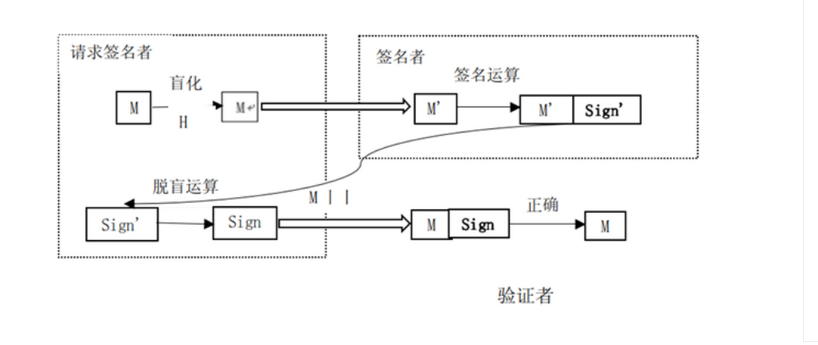

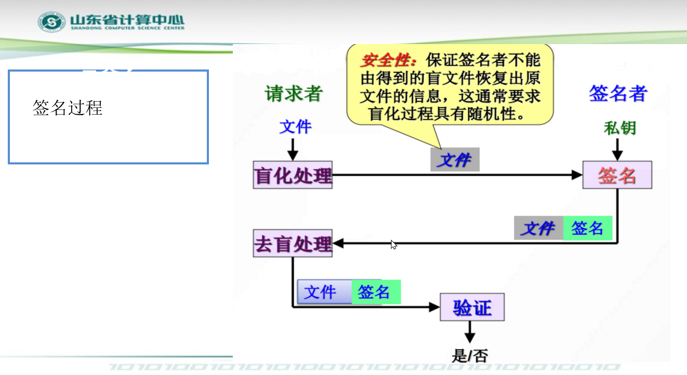

**难点**：**去盲处理不能影响签名**

## 盲RSA签名

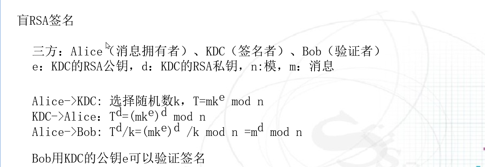

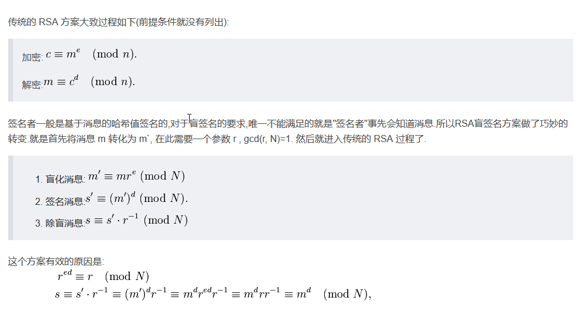

# 多重签名

## 实际需要

公司一个文件，需要部门经理、财务经理、主管副总、总经理共同签批后才能生效。

## 简介

1983年首次提出多重签名

多个用户对同一个消息进行签名

与普通数字签名的区别：多重签名最后生成的签名是**一个**

## 类型

### 广播多重签名

签名顺序无所谓

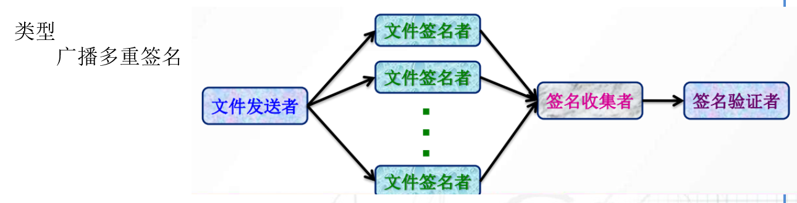

### 有序多重签名

有序签名

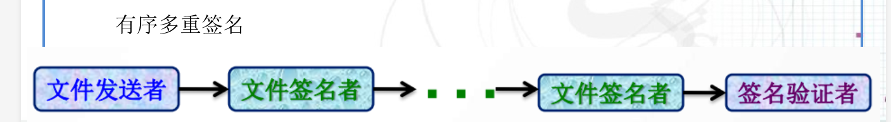

## RSA多重签名

可信第三方基于RSA生成公钥e、私钥d，模数n，为每一个签名者生成
$$
h=H(ID)(公开)
\\
s=h^{-d}\ mod\ n(保密)
$$
每个签名者选择随机数r，计算$R=r^{e}\ mod \ n$，并广播

签名收集者计算$T=R_1*R_2...*R_i\ mod\ n$，并广播

每个签名者计算$m=H(T,M),D=rs^m\ mod \ n$,并广播

签名收集者计算$D=D_1*D_2...*D_i\ mod\ n$,最后的签名为$(D,T,m)$

验证者计算(不全)
$$
T=D^e(h_1h_2...h_i)^m\ mod\ n\\
=(D_1D_2...D_i)^e(h_1h_2...h_i)^m\ mod\ n\\
=(r_1s_1^mr_2s_2^m...r_is_i^m)^e(h_1h_2...h_i)^m\ mod\ n\\
=(r_1r_2...r_i)^e(s_1^es_2^e...s_i^eh_1h_2...h_i)^m\ mod \ n \\
$$

# 群签名

公司的某项决策是由高层管理人员集体决定的，这项决策侵犯了某些员工利益，争议较大，总经理也不愿意签批，由集体签批

## 简介

1991年被首次提出

某个群成员代表群进行签名

验证者不能确定是由哪个群成员进行签名的

## 性质

不可伪造性：只有群成员才能生成群签名

匿名性：验证者只能验证签名某个群的有效签名，不能识别出是哪个群成员

可追踪性：当产生纠纷时，可以通过打开操作看到签名者的身份

抗联合攻击：即使群成员串通，也不能得到群私钥

抗关联性：在不进行打开操作的前提下，不能判断两个群签名是否由同一个群成员签名

## 群签名方案（流程）

### 创建：生成群公钥和群私钥，生成成员私钥和成员公钥证书

可信第三方选择大素数p,原根g

每个成员选择随机数$x_i$作为私钥，则公钥**$y_i=g^{x_i}\ mod \ p$**

可行第三方同样选择随机数$X_S$作为私钥，则公钥$y_S=g^{X_S}\ mod \ p$

### 加入：通过交互协议，对新加入成员生成成员私钥和成员公钥证书

每个群成员向可行第三方发起加入群的请求，并发送自己的公钥$y_i$

可信第三方生成随机数$k_i$，计算$r_i=g^{-k_i}y_i^{k_i}\ mod \ p,s_i=k_i-r_iX_S\ mod \ p,a_i=g^{k_i}\ mod \ p$，并将$r_i,s_i$发送给群成员，存储$r_i,s_i,a_i,y_i$

群成员验证

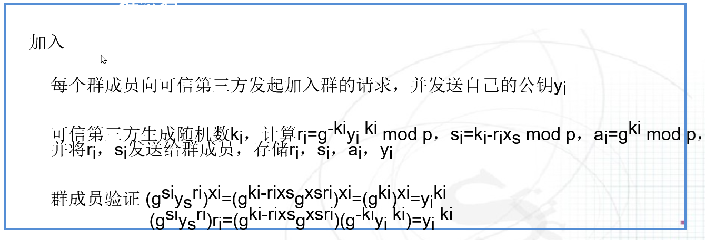

### 签名：输入消息和一个成员的私钥，生成群签名

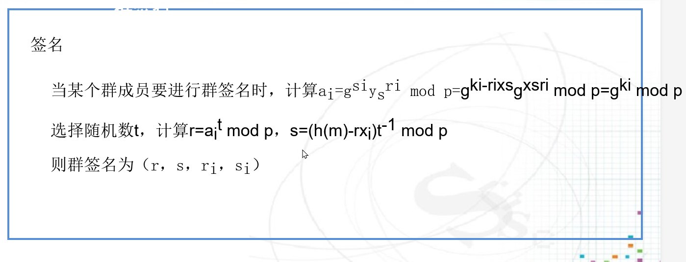

### 验证：验证消息的群签名是否有效

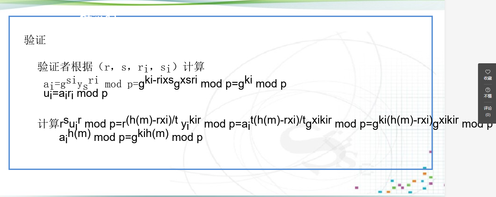

### 打开：揭示群签名由哪个群成员签名的

# 代理签名

## 应用需求

按照公司流程，公司老总需要对所有文件进行签批，如果公司老总由于某种原因无法对某些文件即使签批，可以授权给秘书进行签名

## 含义

三方：原始签名者、代理签名者

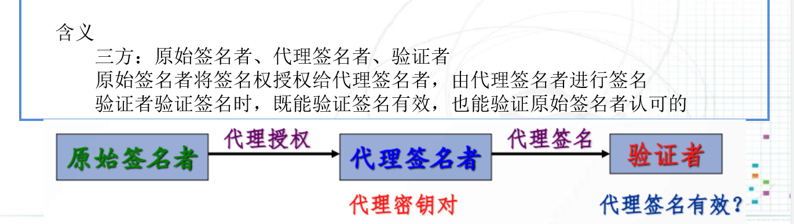

## 类型

完全委托代理签名

部分委托代理签名

授权书代理签名

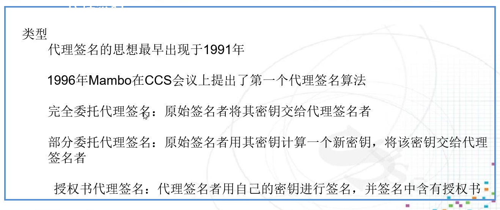

## 性质

可验证性：验证者能够确信这个签名是原始签名者认可的数字签名

可区分性：由代理签名者所签署的签名与原始签名者所产生的签名是有区别的

不可伪造性：只有代理签名者可以生成有效的代理签名

可控性：原始签名者能够有效控制代理签名者的权限，代理有效时间、代理签名次数、代理签署消息的范围等，并防止代理权限的任意传递

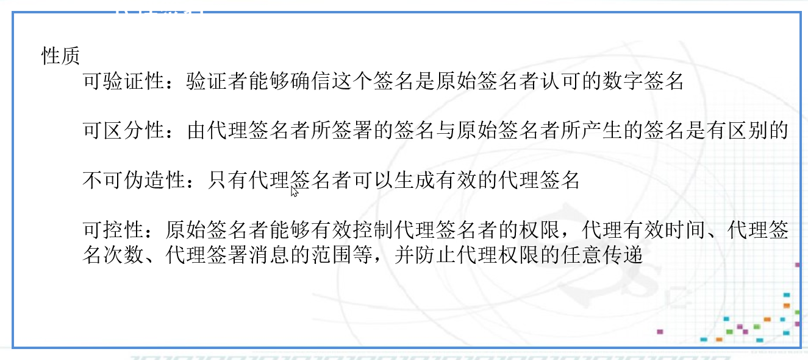

# 其他签名

## 环签名

群签名需要中心节点，环签名不需要

实际需求：国会议员向记者匿名透露消息

## 指定验证者签名

实际需求：版权保护领域，防止盗版

## 门限签名

群n个成员不少于t个成员参与才能生成签名