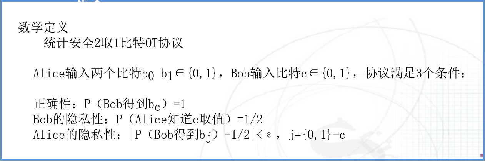
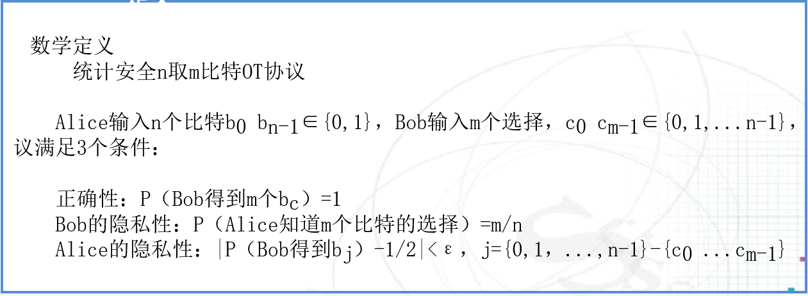
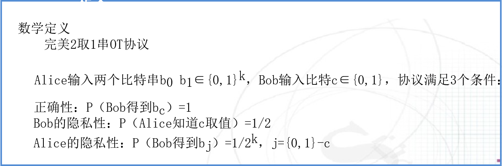
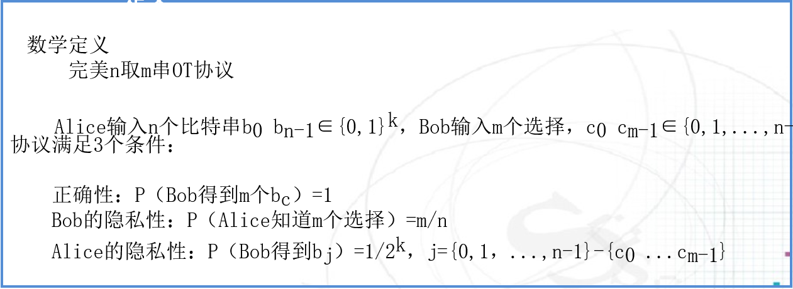
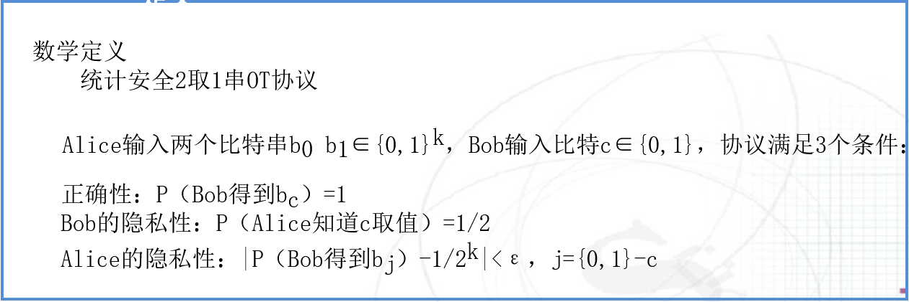
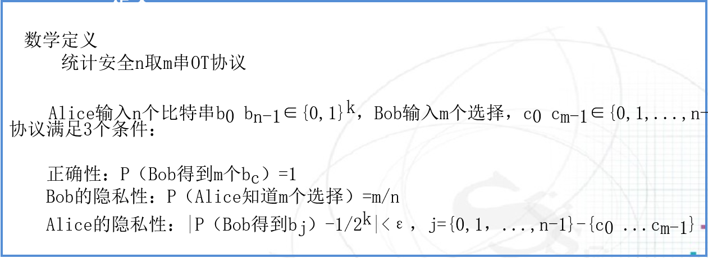

# 不经意传输协议(Oblivious Transfer,OT协议)

不经意传输协议是一个双方协议。

1981年有M.Rabin首次提出，也称为健忘传输协议。

# 定义

## 一个不太恰当的例子

- Alice向Bob送礼
- Bob不愿意让Alice知道Bob是否接受了礼物
- Alice为了让Bob放心，也愿意只关心送礼本身，不关心Bob是否接收礼物
- 使用不经意传输协议。Alice无法知道Bob是否接收了礼物

## 不经意传输协议(Oblivious Transfer,OT协议)

在这个协议中，一方Alice掌握某个秘密信息s，另一方Bob 不知道这个信息，协议结束后Bob以1/2的概率获得信息s，Alice不知道Bob是否得到了消息s，Bob确信其是否接收到该比特。

# 类别

## 2取1 OT协议

Alice输入两个比特$b_0,b_1$,Bob输入比特c，协议运行结束后，Bob确信得到了$b_c$,Alice不知道c是0还是1，Bob无法同时得到$b_0和b_1$。

## n取1 OT协议

## n取m OT协议

# OT协议的应用

## 数据库查询

Bob提供n个查询关键字，Alice返回n个关键字的查询结果，Bob接收某个关键字的查询结果，Alice不知道Bob的真实查询关键字，Bob只能接受该关键字的查询结果，不能收到其它关键字的查询结果。

## 敏感商品购买

Bob提供了n个商品的购买意向，Alice返回n个订单，Bob接收某个订单，Alice不知道Bob购买的哪个商品，Bob只能接收1个订单。

# 数学定义

## 完美2取1比特OT协议

Alice输入两个比特$b_0,b_1∈{0,1}$，Bob输入比特$c∈{0,1}$，协议满足3个条件：

- 正确性：只要A、B双方遵守协议，那么协议结束后接收方Bob将得到他想要的信息。$P_{Bob得到b_c}=1$
- 发送方Alice的保密性：协议结束后，接收方Bob除了得到他想要的信息以外得不到任何多余信息。$P_{Bob得到b_j}=1/2,j=\{0,1\}-c$
- 接收方Bob的保密性：协议结束后，发送方Alice不知道Bob的选择，即Alice不知道Bob得到的是那一个或哪一些信息。$P_{Alice知道c取值}=1/2$

## 完美n取m比特OT协议

Alice输入n个比特$b_0b_{n-1}\in\{0,1\}$，Bob输入m个比特$c_0c_{m-1}∈\{0,1\}$，协议满足3个条件：

- 正确性
- Bob的隐私性：
- Alice的隐私性

## 统计安全2取1比特OT协议

## 统计安全的n取m比特OT协议

## 完美2取1串OT协议

## 完美n取m串OT协议

## 统计安全的2取1比特OT协议

## 统计安全的n取m比特OT协议

# 统计安全2取1比特OT协议 构造 统计安全2取1串OT协议

# 实例

## 基于RSA机制

Alice生成两个公私钥对$K_{pub1}、K_{pri1}、K_{pub2}、K_{pri2}$,将两个公钥发送给Bob

Bob生成1个随机数x，用$K_{pub1}或K_{pub2}$加密x（取决于Bob的选择），发送给Alice

Alice用两个私钥分别解密x，得到$x_1和x_2$,然后计算$x_1$

---------------------------

## Robin OT协议

Alice选择大素数p、q，将n=pq发送给Bob，p、q为要传输的秘密

Bob随机选择x，计算$a=x^2\ mod\ n$,将a发送给Alice

Alice计算$x^2=a\ mod \ p和x^2=a\ mod\ q$的四个根x、n-x、y、n-y，从中随机选择一个发送给Bob

若Bob收到的是x、n-x中的一个，则不能恢复出p、q;若Bob收到的是y、n-y中的一个，则可以恢复出p、q;