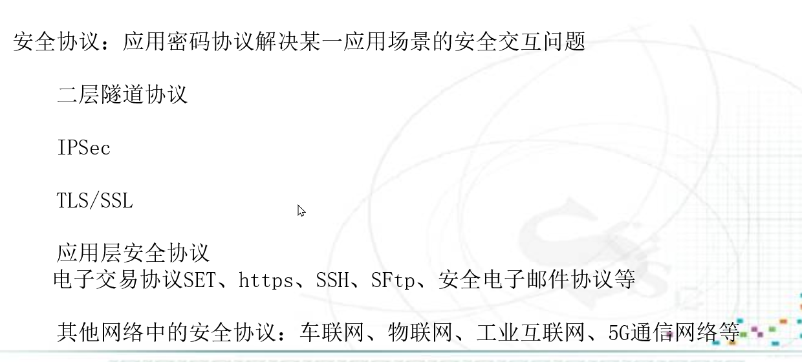

# 课程简介

## 什么是协议：两个或者两个以上参与者为完成某项任务而采取的一系列步骤

- 至少两个参与者
- 目的明确、步骤明确

## 协议的要素：不同终端之间进行通讯的一整套规则

- **语法-Syntax：**数据与控制信息的结构与格式
- **语义-Semantics：**数据与信息所代表的含义与动作
- **时序-Timing：**不同事件、动作所应遵循的时间顺序

## 协议的特点

- 通信双方必须执行相同的协议
- 通信双方必须遵守协议的流程
- 协议必须是明确的，即在什么情况下进行什么样的处理
- 协议必须是完整的，即对可能发生的每一种情况都规定了处理流程

## 通信协议

- 通信各方关于如何进行所达成的一致性规则
- 定义通信实体之间交换信息的格式及意义的一组规则

## 密码协议

以密码算法为基础的通信协议，完成特定的安全服务

## 安全协议

应用密码技术（包括密码协议但不限于密码协议）解决信息的安全交换问题。

## 知识体系

# 如何设计安全协议

## 好的安全协议应该满足的条件

- 能够满足安全目标‘
- 易于实现
- 各参与方所需要的计算量和存储空间较少
- 通信负载小
- 交换轮数少

## 三种基本属性

### 保密性

保证信息不泄漏给未授权用户的能力，即便未授权用户得到了信息的载体也无法获得信息的内容。

### 完整性

保证信息未经授权不能进行修改的能力，及信息在存储、传输、处理的过程中保持不被篡改、破坏、丢失的性质，既包括数据的完整性，也包括系统的完整性。

### 可用性

保证授权实体能够按需问各种资源的能力，系统能够在合理的时间内完成规定的功能。

## 扩展属性

- 真实性，是指能够对通信实体身份的真实性进行鉴别；
- 可控性，是指实体的各种行为和过程均是在受控的状态下进行，不存在不受控制的状态；
- 可靠性，是指所传输的信息是真实可信的；
- 不可否认性，是指信息的发送者和接收者不能否认其发送或接受过该消息；
- 可审查性，是指对出现的安全问题提供调查的依据和手段，能够追查到行为人。

# 密码分析

- 唯密文攻击
- 已知明文攻击
- 选择明文攻击
- 选择密文攻击

# 安全性度量

- 无条件安全
- 可证明安全
- 计算安全

# Dolev-Yao(姚期智)攻击模型

## 攻击者能力

## 攻击者攻击类型

# 在某种攻击模型下，设计和分析协议

## 计算困难性问题

### 什么是图灵机

## P问题与NP问题

## 密码学中常用的计算困难性问题

# 安全协议的缺陷：设计错误或代码错误

[Padding攻击]: https://zh.wikipedia.org/wiki/%E5%AF%86%E6%96%87%E5%A1%AB%E5%A1%9E%E6%94%BB%E5%87%BB

