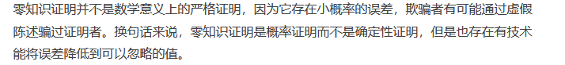
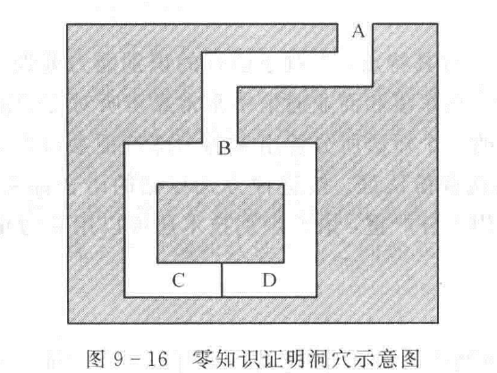
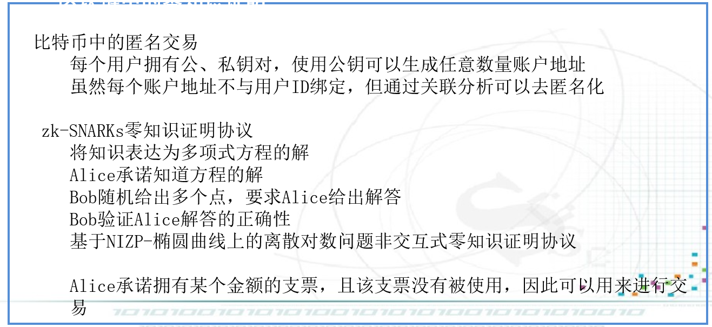

# 概念

Alice试图向Bob证明：Alice知道某个事实，但不告诉Bob这个事实的内容

## 例子

1、Alice知道了某次选举的结果，但结果还没有公布，Alice向Bob宣称知道谁当选了，但不能告诉Bob谁当选了-------**比特承诺**

2、Alice知道某个人当选暗箱操作的内幕，这个信息不会公开。Alice向Bob宣称回到这个消息，但不能告诉Bob。------**零知识证明**

## 性质

- 正确性：Alice如果不知道这个事实，Alice无法欺骗Bob
- 完备性：Alice如果知道这个事实，一定能让Bob相信
- 零知识性：Bob无法获得任何额外的信息

## 简单模型

C、D之间有道门，Alice知道开门的钥匙，Alice不能出示钥匙给Bob看，又要向Bob证明他知道钥匙。

### 协议步骤

- Bob站在A点，Alice站在B点，Bob看不到Alice

- Alice选择走到C点或D点，Bob走到B点

- Bob要求Alice从左边或者右边走出来

- Alice执行，必要的时候用钥匙打开门

上述过程执行n次

为什么不让Bob站在B点让A从左边进从右边出？

原因：在网络环境中，这一点很难做到。

# 分类

## 根据协议双方是否进行交互

- 交互式零知识证明
- 非交互式零知识证明

## 根据要证明的内容

- 知识点零知识证明：Alice向Bob证明知道某个知识
- 成员的零知识证明：Alice向Bob证明某个输入隶属于某个集合
- 计算能力的零知识证明：Alice向Bob证明知道求解某个算法问题

# 交互式零知识证明

- Alice是证明者，Bob是验证者
- Alice承诺知道某个知识
- Bob给出挑战，Alice基于承诺给出响应，证明他知道这个知识

# 非交互式零知识证明

- 仅需要发送一条消息
- Alice和Bob恭喜那个公共参数
- Alice向Bob发送证明消息
- Bob验证该消息

# 实例

## 平方根问题的零知识证明

- 两个大素数p、q,n=pq,设$y=x^2\ mod \ n$,已知y，求解x。Alice宣称知道x的一个解，但不想公开，向Bob证明该知识
- Alice随机选择r,计算$s=r^2\ mod\ n,ys=(xr)^2\ mod\ n$,将s发送给Bob
- Bob随机选择0或1
- 如果Bob选择0，则Alice向Bob发送r；如果Bob选择1，则Alice向Bob发送xr
- Bob验证收到的数值的平方，然后mod n是等于s还是等于ys
- 只有当Bob收到的是xr时，可以验证Alice确实知道x的一个解

## 离散对数问题的零知识证明

- 已知y,Alice知道方程$y=g^x\ mod\ p$中x的一个解，向Bob进行零知识证明
- Alice随机选择t,计算$s=g^t\ mod\ p,ys=g^{t+x}\ mod\ p$,将s发送给Bob
- Bob随机选择0或者1
- 如果Bob选择0，则Alice向Bob发送t；如果Bob选择1，则Alice向Bob发送t+x
- Bob验证该数值作为g的指数，然后mod p,等于s还是等于ys

## Feige-Fiat-Shamir零知识证明认证协议

- 公共参数：大素数p、q,n=pq,随机数a，$v=a^2\ mod\ n,v^{-1}=s^2\ mod\ n$，其中v是用户的公钥，s是用户的私钥

- Alice选择随机数r,计算$x=r^2\ mod\ n$，发送给Bob
- Bob随机选择0或者1
- 如果Bob选择0，则Alice发送r给Bob；如果Bob选择1，则Alice发送rs给Bob
- Bob验证$r^2\ mod\ n$,或者$(rs)^2v\ mod\ n$是否等于x

- 数字签名可以视为非交互式的零知识证明

## 交互式与非交互式

- 通过随机数挑战是交互式零知识证明的安全基础
- 非交互式零知识的安全基础？

## NIZP-非交互式零知识证明协议

- $y=g^x\ mod\ p$
- Alice随机选择t，计算$s=g^t\ mod\ p,u=H(y,s),w=t-ux\ mod\ p$,发送(s,w)
- Bob验证$g^wy^u\ mod\ p==s?$

## 比特币中的匿名交易

