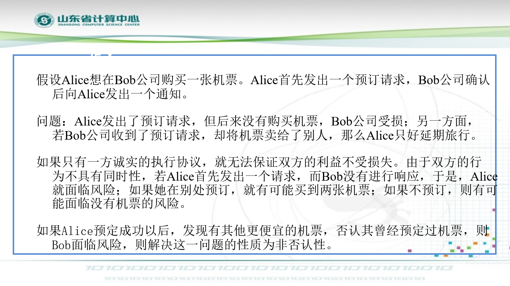

# 公平交换协议

# 定义

## 例子

## 数学定义

当一个系统涉及到两个或者多个互不信任的主体，就要考虑满足所有主体的安全性

- 从主体利益的角度考虑，如果一个系统不会损害其中任何一个诚实主体的利益，那么该系统具有公平性
- 从交换的结果考虑，如果在交换结束后，要么每一方都得到了他所期待的信息或者物品，要么每一方都没有得到任何有意义的东西，我们也认为该系统具有公平性。

需要存在相应的安全机制来保证交换顺利进行，这种安全机制即使公平交换协议。

# 模型

假设desc()为交换商品的描述函数(对输入的任何一个交换商品，返回一个对该物品的描述)，P、Q为参与双方，他们的交换物品用$i_P,i_Q$表示，期望得到的对方交换物品的表述为$d_P,d_Q$。

## 公平交换问题表述如下

交换之前P输入$i_P、d_Q、Q$，Q输入

## 基本要求

- **有效性**：如果两个参与者行为正确，在不涉及第三方的情况下，仍能获得各自所需的东西。
- **秘密性**：交换必须保护用户的隐私信息。
- **高效实用性**：协议的效率要高，以保证实用性。
- **终止性**：在协议执行的任何时间，每个参加者可以单方面中止协议而不破坏公平性。
- **第三方可验证性**：发生纠纷时第三方可以进行仲裁，对不诚实的一方可以进行制裁。同时，如果第三方不诚实的使得该协议对Alice不公平，则Alice可以向仲裁者证明第三方的不公正行为。
- **无滥用性**：在多方公平交换模型中参与交换的任意子集在协议的任何时刻都无法向第三者证明他们又能力中止（或完成）协议。

# 公平性

强公平性

弱公平性

# 分类

## 带有仲裁者的同时签约（非面对面）

## 无仲裁者的同时签约（面对面）

## 无仲裁者的同时签约（非面对面）

## 无仲裁者的同时签约(使用密码技术)-使用不经意传输技术

