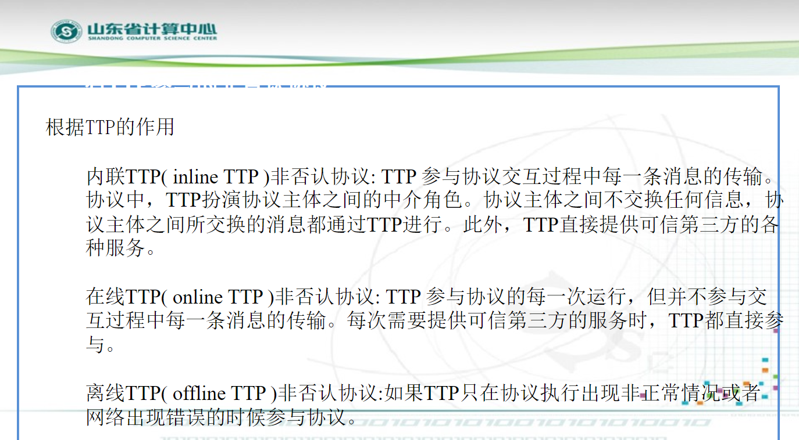

# 非否认协议

# 基本概念

## 非否认协议

- 为了防止不诚实者否认他们参与了某项事务而拒绝承担相应的责任而设计的协议
- 为参与方的行为提供证据，使其不能否认自己的行为

## 非否认的分类

- 发送方非否认：发送方不能否认其发送过某个消息
- 接收方非否认：接收方不能否认其接受过某个消息

## 通过仲裁解决争端

非否认协议收集、维护、公布和验证那些与某个事件或动作相关的不可抵赖的证据，并将这些证据用于解决参与通信的双方的争执。

## 非否认证据

- 发送方非否认证据（evidence of origin，EOO）
- 接收方非否认证据（evidence of receipt，EOR)

## 非否认协议的步骤

- 服务请求：实现通信双方必须确认后续的通信行为执行非否认
- 证据产生：证据产生与关键行为相关联，而且有一方或操作一致的某几方组成的群体来完成，关键行为的潜在否定者的哪一方需要参与证据产生，必要时可信第三方参与
- 证据传递和储存：关键行为发生后，证据已经产生，证据要被传递到最终需要使用的一方或几方，或被可信第三方储存可能作为将来的参与
- 证据验证:为了让各方信任证据将会足以应付纠纷引发的时间，有必要核对被传递的或被可信地保存着的证据。
- 纠纷解决：纠纷可能发生在那些阶段之后不久（如在同一个通信回话中）但更可能发生在之后很久（如几年之后）。如果这一阶段发生的话，必须找回证据，重新核实它，然后解决纠纷。这里需要一个仲裁者。

## 通信双方可能存在的异常情况

- 传输的消息可能是伪造的，并非来自于消息的发送者
- 发送者宣称发送过某个消息或者接收者宣称收到某个消息，而该消息根本没有被发送
- 消息在发送过程中意外丢失
- 消息到达接收方时，完整性破坏
- 消息到达时已经超时

## 否认的内容

## 例1

## 例2

# 根据TTP的作用

