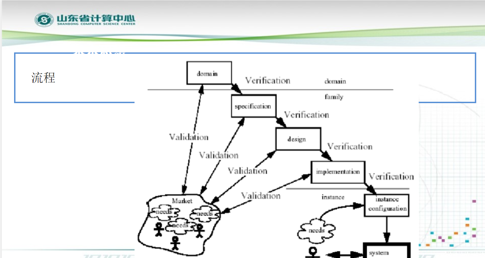
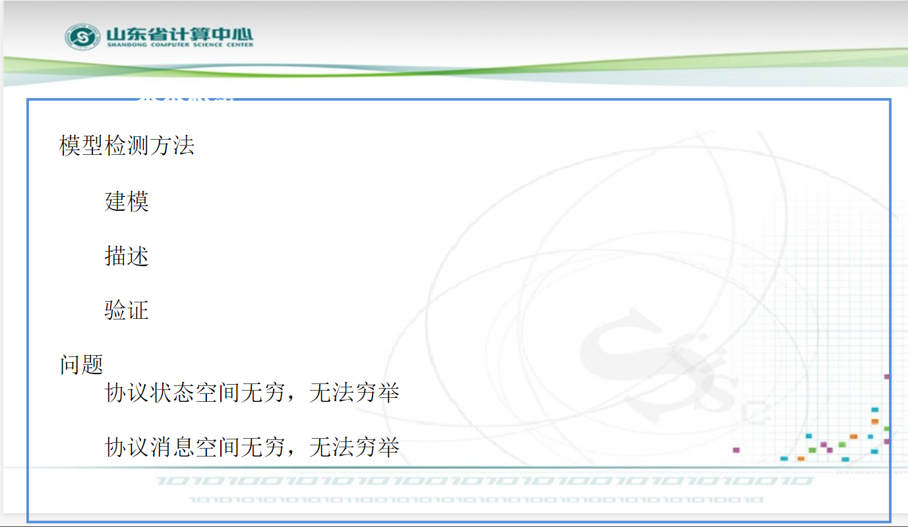
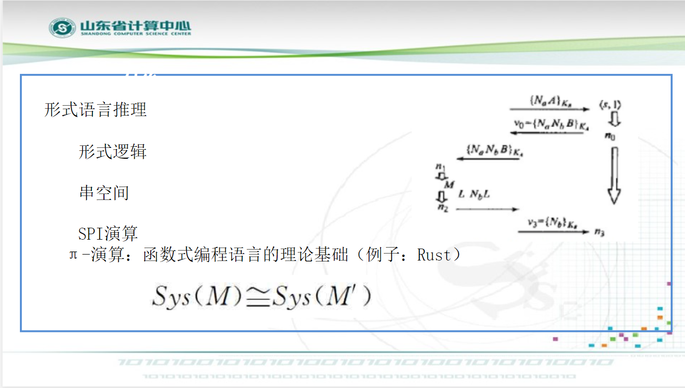
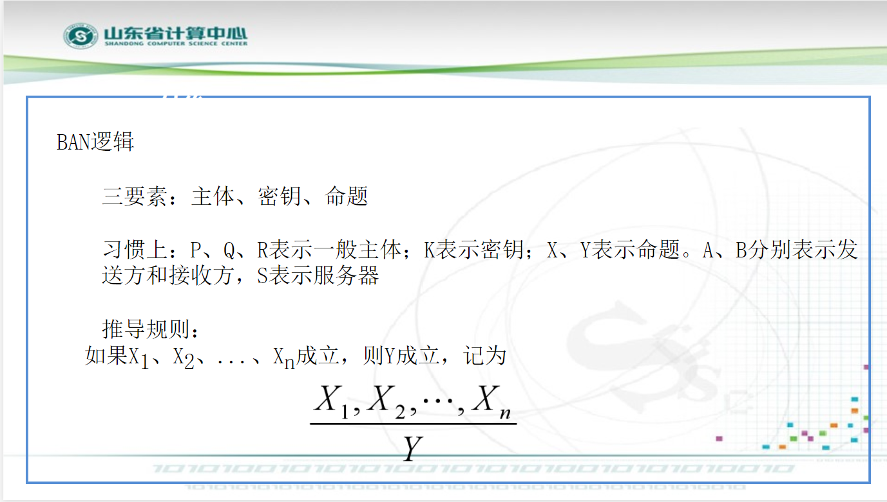
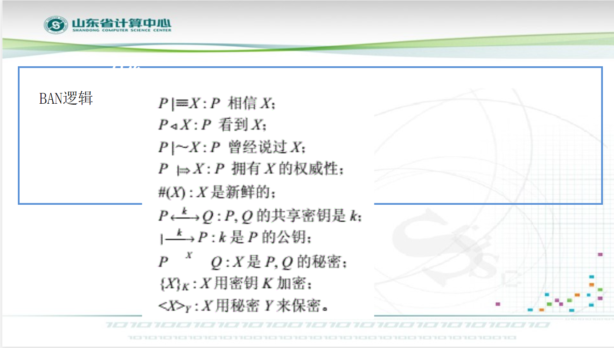
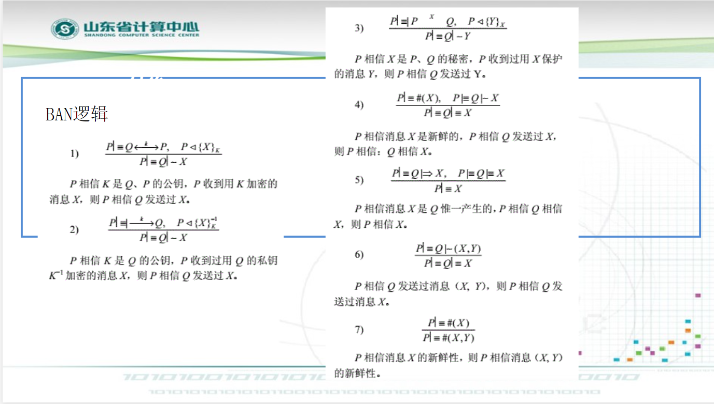
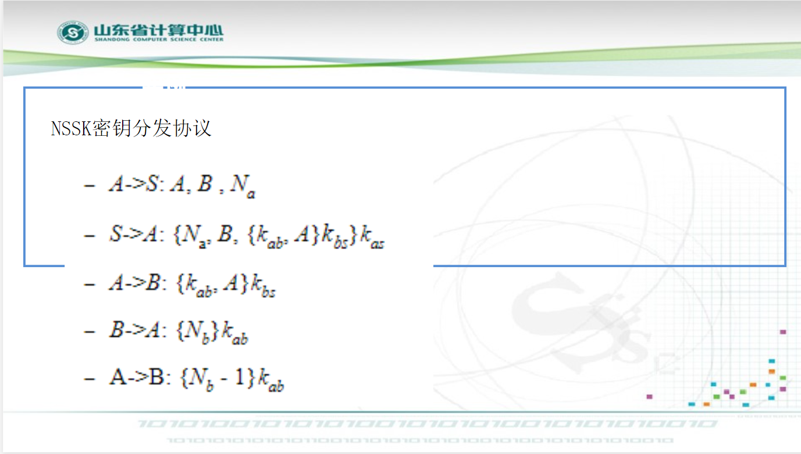
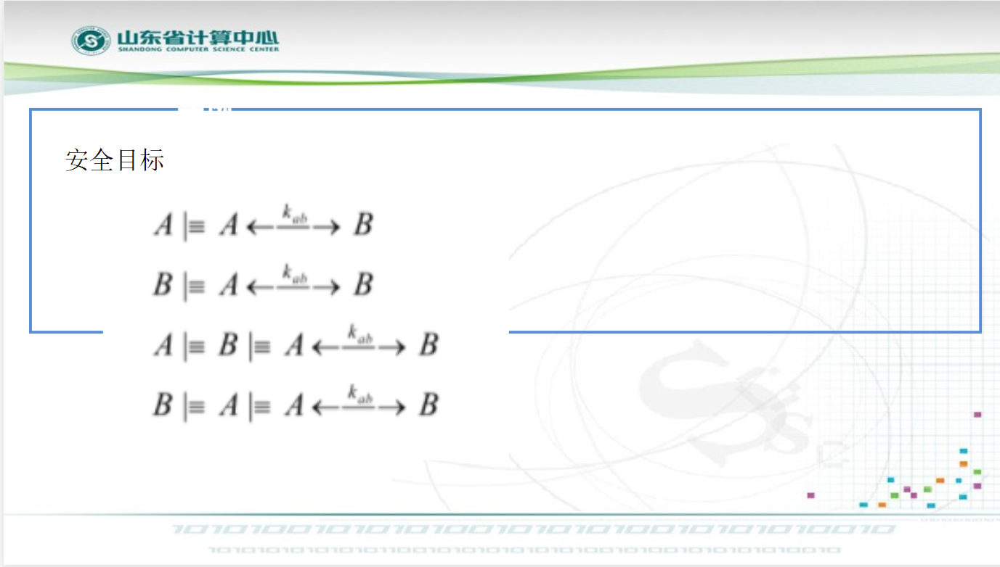
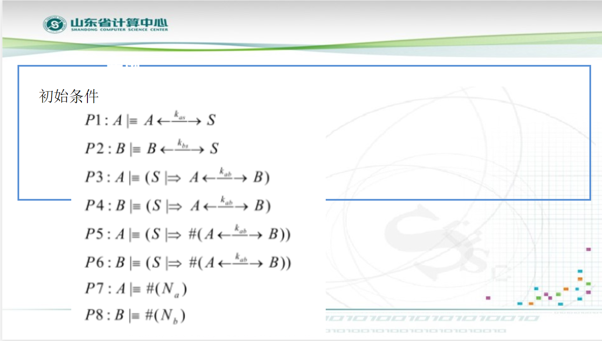
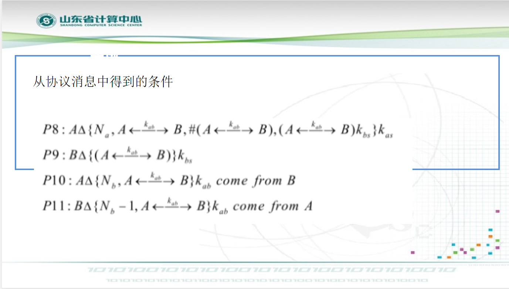

# 基本思想

## 意义

任何协议，如同软件代码，可能会存在错误，需要通过形式验证发现错误或者证明安全和正确

## 验证的含义

- 正确性：协议的实现是否完整、正确的实现了协议的设计
- 安全性：在恶意攻击的情况下，协议的实现是否能识别、抵抗恶意攻击

## 如何验证

将验证目标规约为一系列的逻辑条件与结论，形式验证即在一定假设或前提条件下，验证协议是否能够达到目标中的结论

## 形式语言

- 使用自然语言分析逻辑命题常常导致歧义
- 使用符号语言，也就是形式语言，描述命题的逻辑形式

## 语法和语义

- 语义：定义符号和符号的含义
- 语法：符号如何构建逻辑公式，以及逻辑公式的推理

## 流程

## 方法

- 人工检查
- 自动检查：形式描述语言

### 形式验证方法

- 状态检查：穷举协议所有可能状态，分析是否存在违反协议目标的状态
- 定理证明

### 模型检测方法

## 定理证明

- 将协议转换为某种形式的逻辑
- 建立推理系统，将协议性质或目标转换为需要证明的定理命题
- 通过逻辑推理构造证明过程

### 问题

- 建模困难，逻辑语言可能无法表达协议所有的性质

# 性质

## 一般性质

- 状态可达性：协议从初始状态开始，是否存在不可达的协议状态
- 死锁：协议处于等待状态，等待某一事件的发生，但该事件不可能发生
- 可恢复性：当协议运行出现错误后，能不能在有限步骤内自动恢复到正常状态
- 互斥性：某些协议动作不能被多个用户同时执行，例如多个用户不能同时请求同一资源
- 终止：协议存在终止状态，且在有限时间内完成从初始状态到终止状态

## 形式语言推理

## BAN逻辑

### 三要素

### NSSK密钥分发协议

