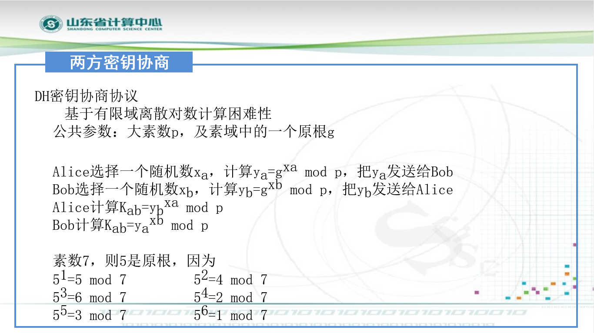
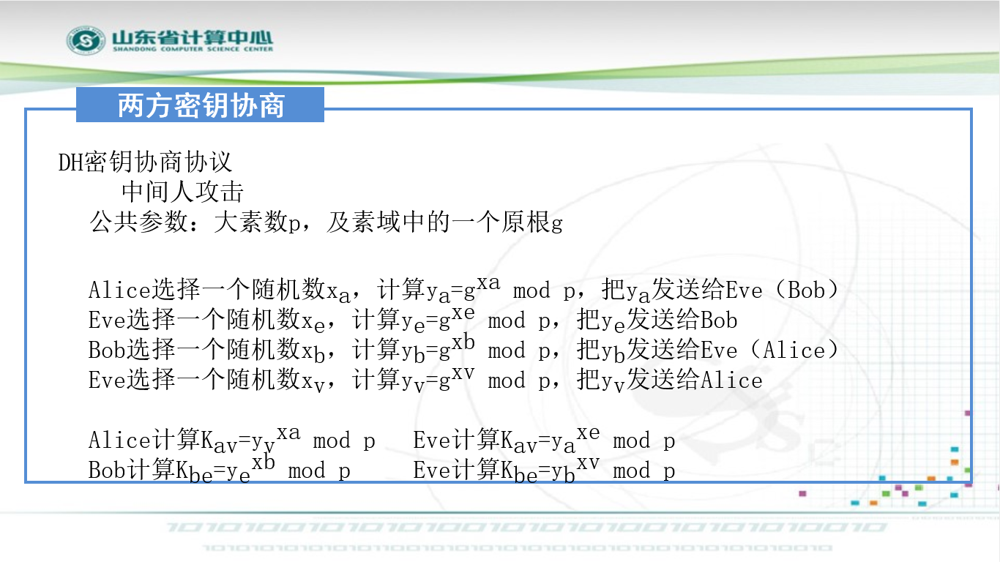
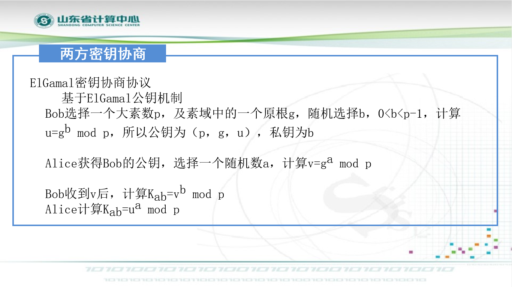
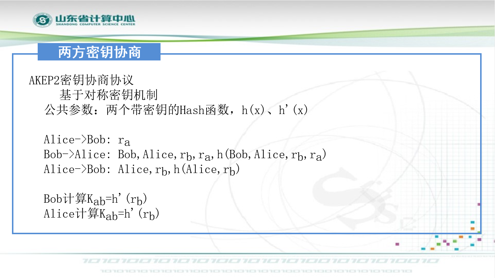
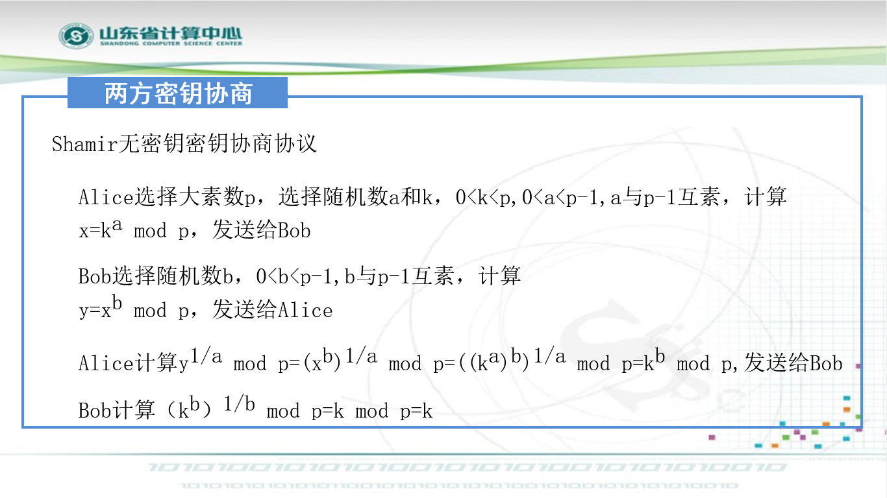
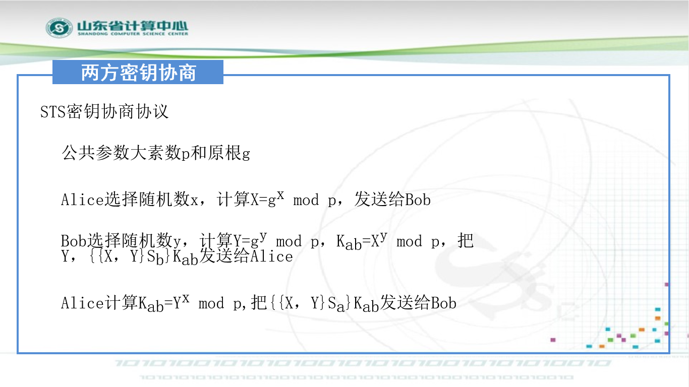
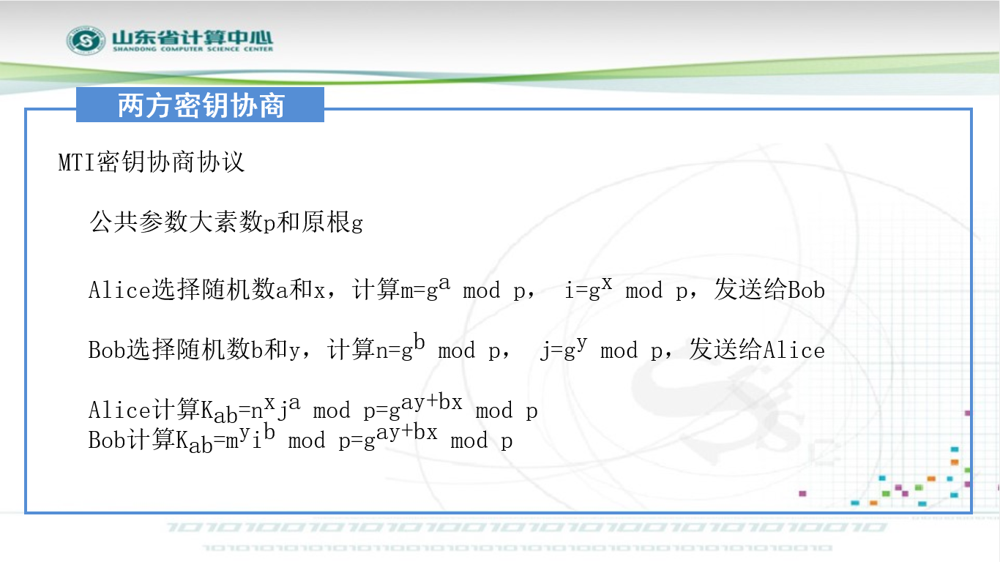
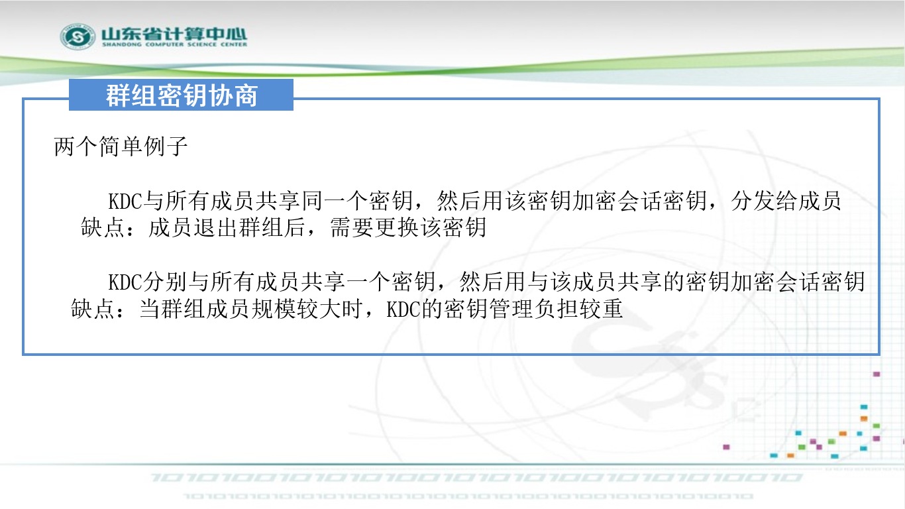
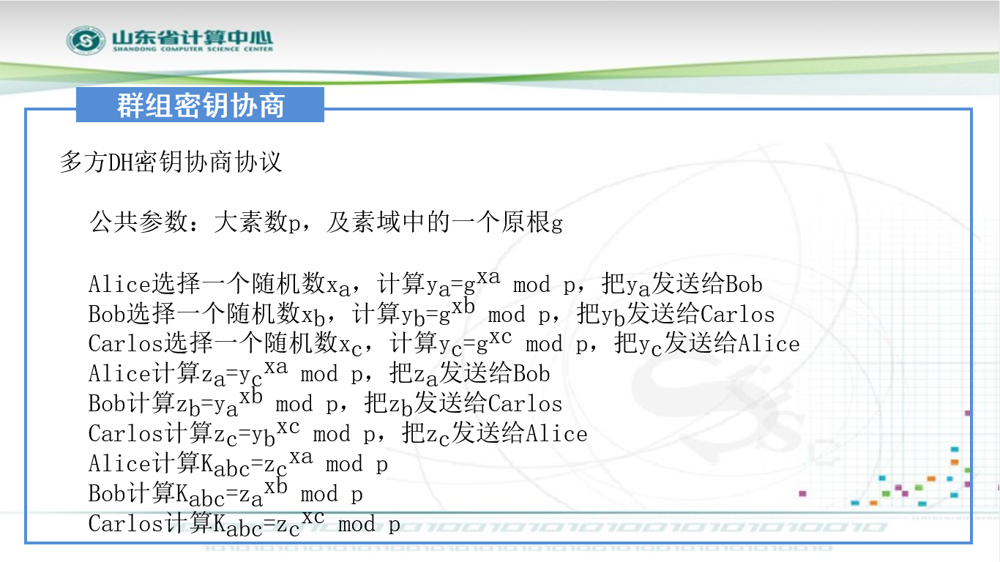
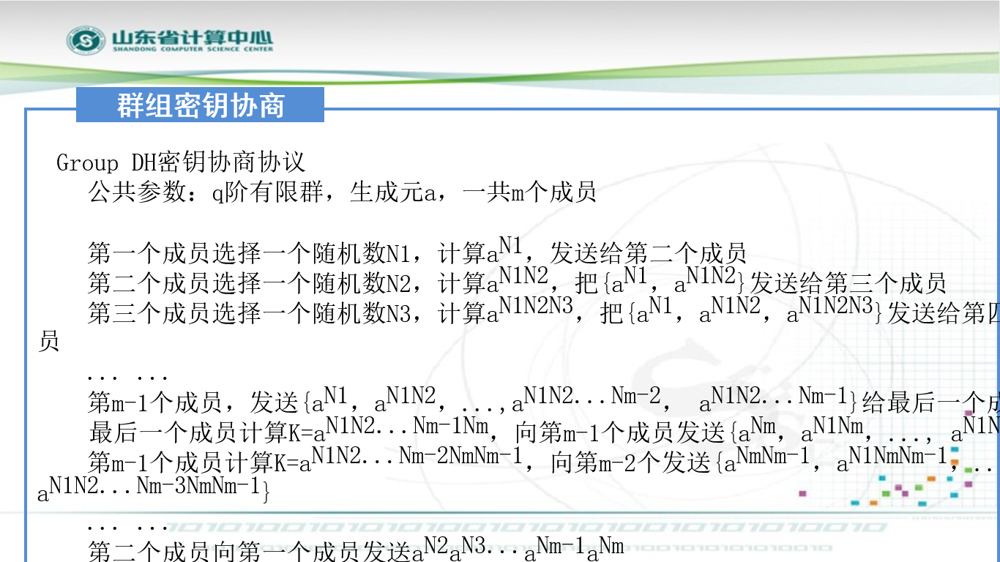

# 密钥协商协议

- 两方密钥协商
- 去租密钥协商

# 两方密钥协商

## DH密钥协商协议

### 中间人攻击

## ElGamal密钥协商协议

## AKEP2密钥协商协议

## Shamir无密钥密钥协商协议

## STS密钥协商协议

## MTI密钥协商协议

# 群组密钥协商

## 例子

## 多方DH密钥协商协议

## Group DH密钥协商协议

