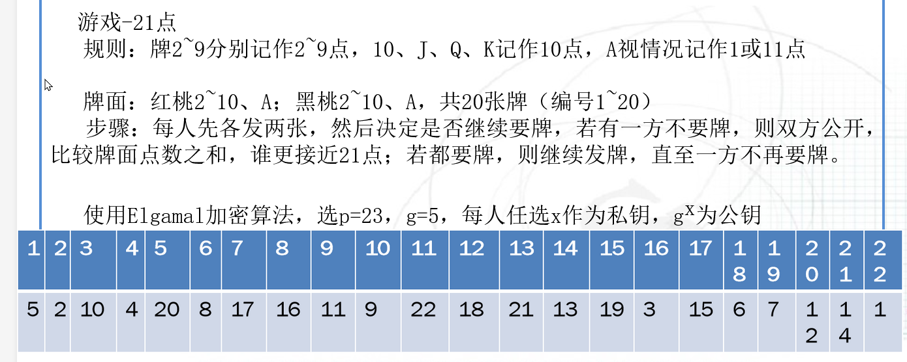
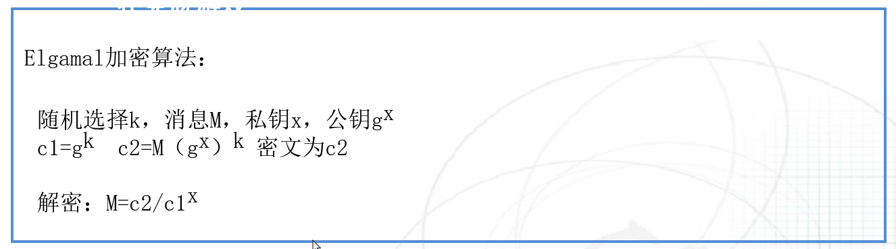

# 基本思想

1982年Blum（图领奖获得者）提出比特承诺的思想

## 魔术--彩票预测

- 魔术师把写有预测彩票号码的纸张放入保险箱
- 彩票号码开出后，打开保险箱，展示所预测的号码

## 网络赌博

- 庄家掷骰子，玩家押大小
- 庄家公开骰子大小

## 现实生活中的实例

- Alice将承诺的比特或秘密写在一张纸上，然后将这张纸锁进一个保险箱，该保险箱只有唯一的钥匙可以打开。
- 在承诺阶段，Alice将保险箱送给Bob，但是保留钥匙；
- 在揭示阶段，Alice将比特或秘密告诉Bob，同时将钥匙传给Bob使其相信自己的承诺。

## 转述

发送者Alice向接收者Bob承诺一个比特b（如果是多个比特，即比特串t,则称为比特 串承诺），要求：

- 第1阶段即承诺阶段：Alice向Bob承诺这个比特b，但是Bob无法知道b的信息；
- 第2阶段即揭示阶段：Alice向Bob证实她年第1阶段承诺的确实是b，但是Alice无法欺骗Bob（即不能在第2阶段篡改b的值）。

## 性质

- 正确性：如果Alice和Bob均诚实地执行协议，那么在揭示阶段Bob将正确获得Alice承诺的比特b。
- 保密性:在揭示阶段之前Bob不能货值b的信息。
- 绑定性：在承诺阶段结束之后，Bob只能在揭示阶段获得唯一的b（即Alice无法将b反转，就好像Alice与b“绑定”在一起一样）。

## 数学描述

给定随机数r和待提交的承诺b，关于b的比特承诺协议就会找到一个算法F，满足：

- 从$F(r,b)$计算出b的难度相当于攻破某个密码算法
- $F(r,b)$的提交者计算$F(r,b)=F(r,b^`)$的概率可以忽略

## 安全性

- 屏蔽性：承诺b一旦被掩盖，对方无法反向计算b
- 约束性：承诺b一旦被掩盖，承诺者无法修改b

# 基本协议

## 基于对称密码算法

### 承诺阶段：

$$
Bob->Alice:随机数r \\
Alice->Bob:(r,b)K
$$

### 公开阶段:

$$
Alice->Bob:K
$$

## 基于Hash函数

### 承诺阶段：

$$
Bob->Alice:随机数r \\
Alice->Bob:H(r,b)
$$

### 公开阶段:

$$
Alice->Bob:b
$$

## 基于伪随机序列发生器

### 承诺阶段：

$$
Bob->Alice:随机比特串r \\
Alice->Bob:Alice有一个随机数生成器，若r的某比特为0，则输出该随机数发生器的输出，\\若r的某比特为1，则输出该随机数发生器的出处与b的比特的异或
$$

### 公开阶段:

$$
Alice->Bob:b、Alice的随机数发生器
$$

# 多方比特承诺

应用：联合体投标

# 扑克牌游戏

## 流程

给每张扑克牌编号：1,2，...

Alice用自己的公钥算法加密每张扑克牌，并打乱顺序，发给Bob

Bob从中任意选择n张牌，回复给Alice，Alice解密后，得到自己的牌

Bob继续从中选则n张牌，用自己的公钥算法加密，回复给Alice

Alice解密这n张牌，发给Bob

Bob再解密这n张牌，作为自己的牌

每次出牌时，用对方的公钥算法验证所有出牌的正确性

## 游戏-21点

