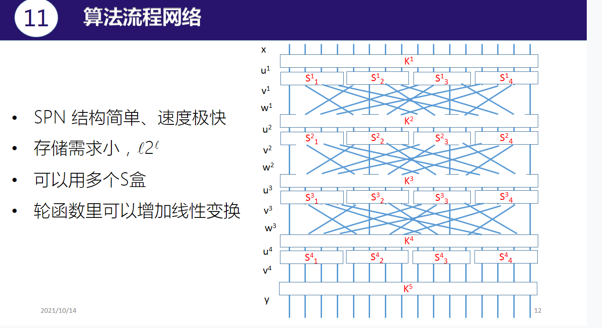

# 上节回顾

# 代换-置换网络

# 迭代密码的形式化描述

# SPN

## SPN实例 

## SPN流程

## 例题3.1 一个SPN实例

# 线性密码分析

## 介绍

## 线性密码分析的可行性

## 线性密码分析思路

## Matsui算法

# S盒的线性逼近

# 堆积引理

## 堆积引理

# SPN线性逼近

# DES线性分析

## Feistel型密码

