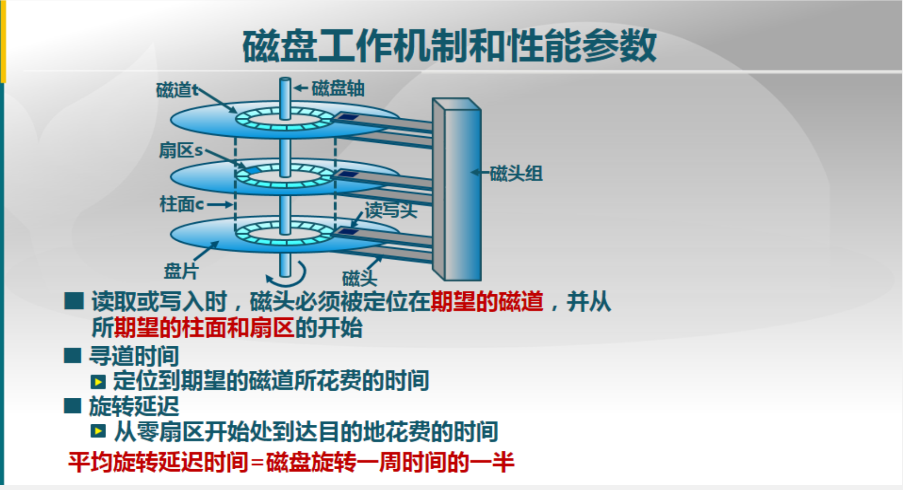
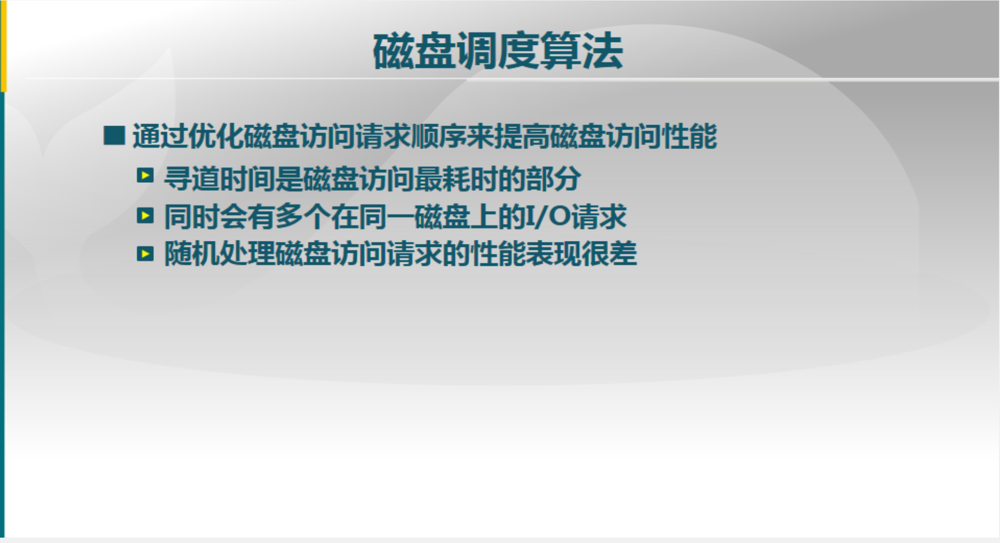
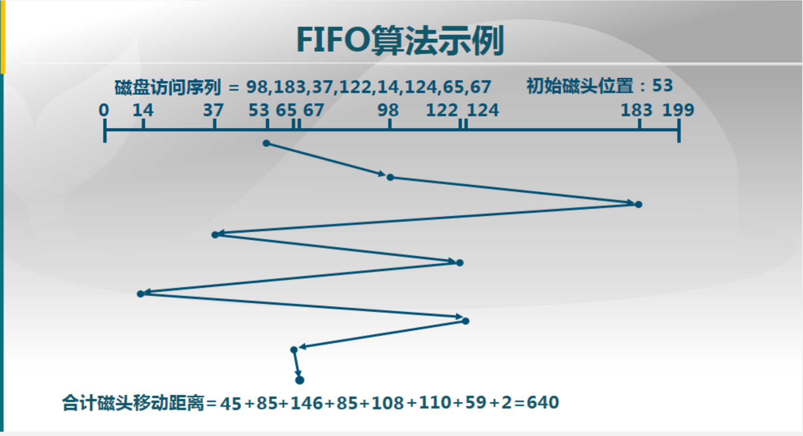
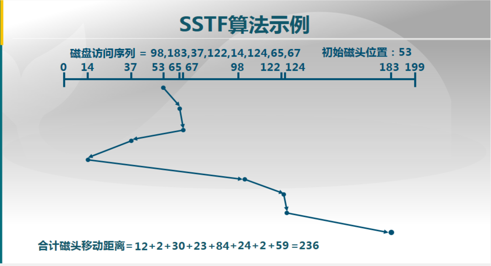
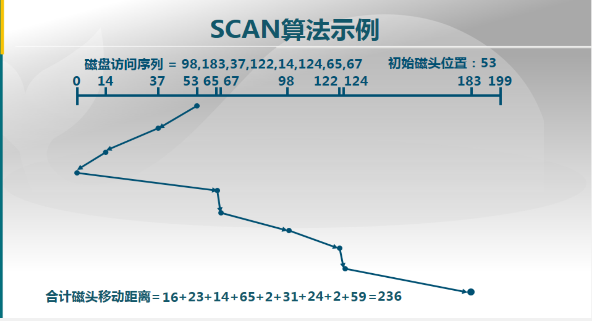
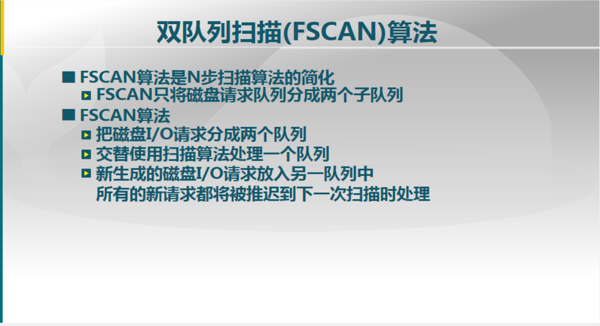

# 磁盘工作机制和性能参数

# 磁盘I/O传输时间

$$
T_a:访问时间\\T_s:寻道时间\\1/{2r}:旋转延迟\\b/rN:传输时间\\b:传输的比特数、N=磁道上的比特数、r=磁盘转数
$$

# 磁盘调度算法

## FIFO先进先出算法

- 按顺序处理请求
- 公平对待所有进程
- 在有很多进程的情况下，接近随机调度的性能

### 算法示例

## SSTF最短服务时间优先算法

- 选择从磁臂当前位置需要移动最少的I/O请求
- 总是选择最短寻道时间

### 算法示例

## SCAN扫描算法

- 磁臂在一个方向上移动，访问所有未完成的请求，直到磁臂到达该方向上最后的磁道
- 调换方向
- 也称为电梯算法

### 算法示例

## C-SCAN循环扫描算法

- 限制了仅在一个方向上扫描
- 当最后一个磁道也被访问过了后，磁臂返回到磁盘的另外一端再次进行

## LOOK算法和C-LOOK算法

- SCAN和C-SCAN算法改进：磁头移动只需要到达最远端的一个请求即可返回，不需要到达磁盘端点
- SCAN改进为LOOK，C-SCAN改进为C-LOOK

# N步扫描（N-step-SCAN)算法

## 磁头粘着（Arm Stickiness)现象

- SSTF、SCAN和CSCAN等算法中，可能出现磁头停留在某处不动的情况
- 如：进程反复请求对某一磁道的I/O操作

## N步扫描算法

- 将磁盘请求队列分成长度为N的子队列
- 按FIFO算法一次处理所有子队列
- 扫描算法处理每个队列

## 双队列扫描（FSCAN）算法

