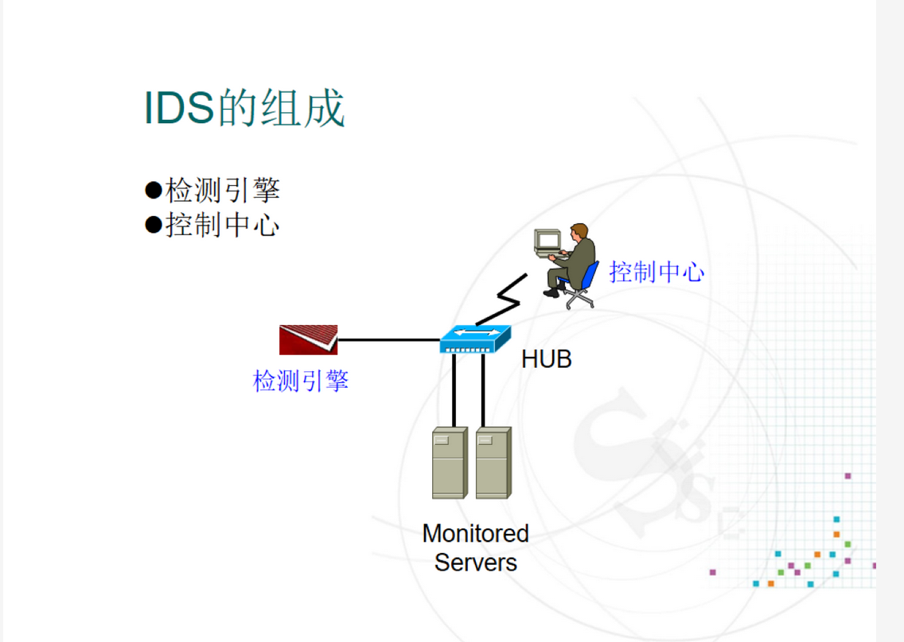
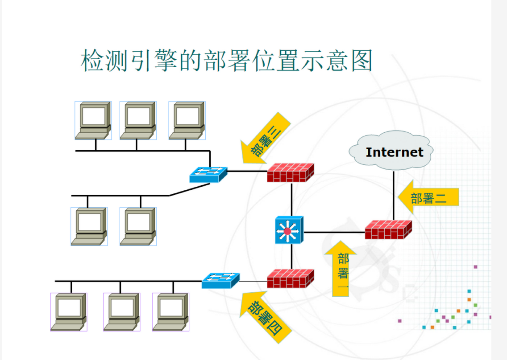
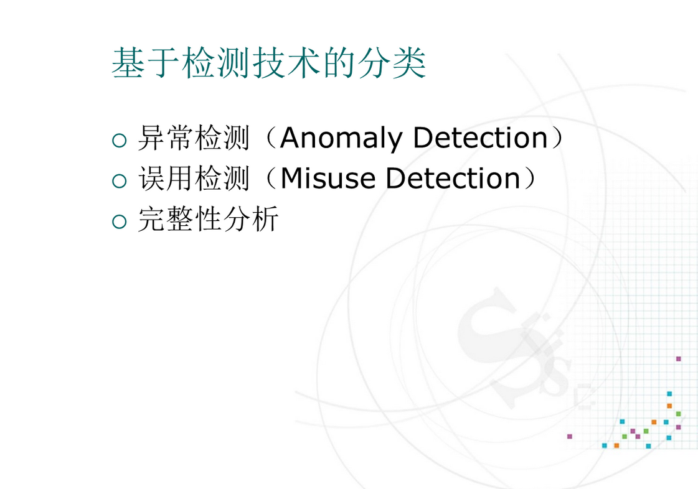
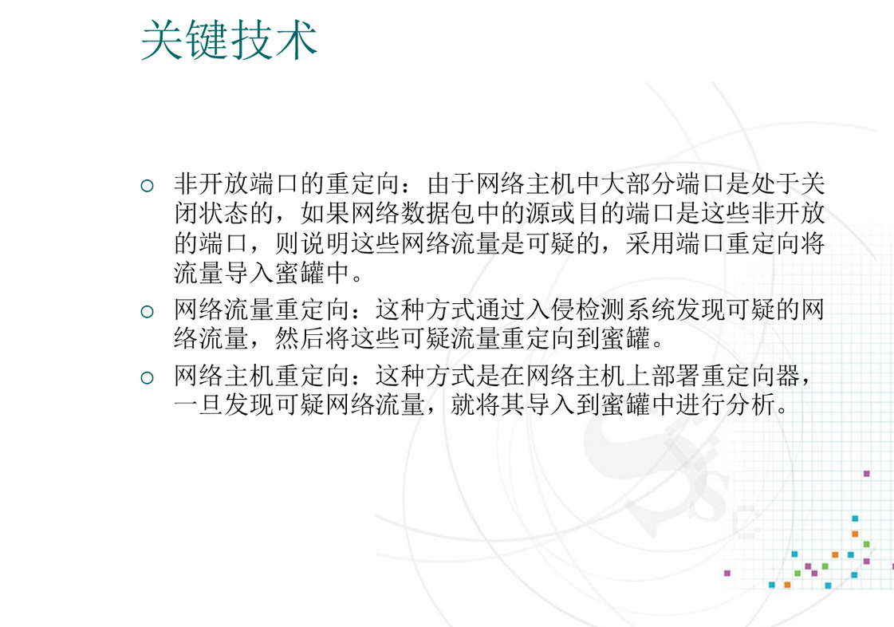

# 主要的传统安全技术

# 传统安全技术的局限性

# 入侵检测系统概述

## 入侵检测系统的定义

# 入侵检测系统分类

## 按照检测对象分类

### 基于主机的入侵检测系统

### 基于网络的入侵检测系统

### 混合式入侵检测系统

## 按系统各模块的运行方式

# 入侵检测过程

## 信息收集

## 信息分析

## 结果处理

# IDS的组成

## 检测引擎的部署位置

## 入侵检测引擎工作流程-1

## 入侵检测引擎工作流程-2

# 入侵检测性能关键参数

# 计算机应急响应

