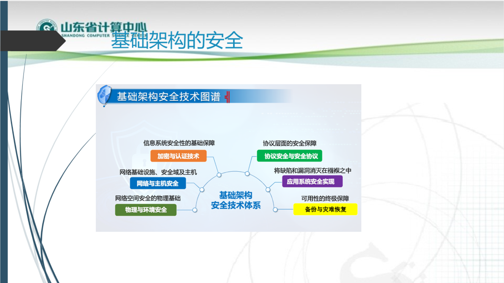
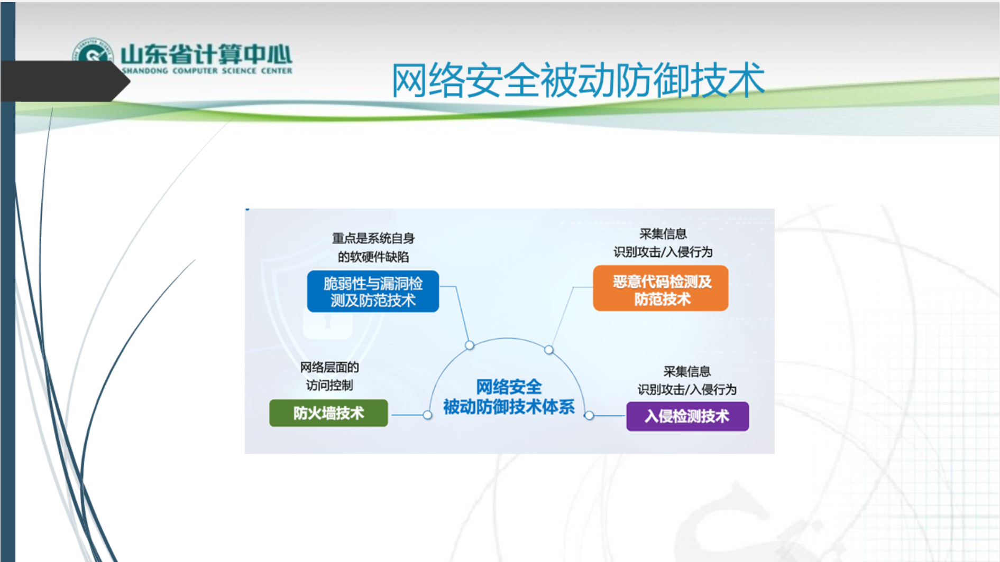
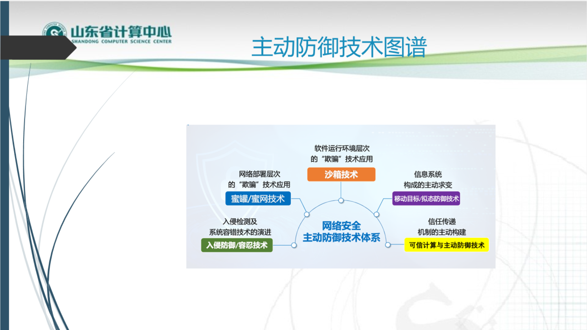

# 网络安全概述

- 网络安全的基本概念：定义、属性、层次结构
- 网络安全模型：PDR、PPDR、PPDRR和基于生命周期的网络安全模型等
- OSI安全体系结构：安全攻击、安全服务、安全机制

# 身份认证

- 身份认证概述
- Kerberos认证
- 数字证书及X.509证书
- PKI和PMI

# Internet安全

网络安全协议(网络安全保障的基础)：

- IPSec协议：概述、框架组成、IPSec协议IPSec之AH和ESP、IPSec之IKE
- TLS/SSL协议：SSL体系结构、记录协议、修改密码规范协议、报警、握手协议
- HTTPS、HTTP、SSH
- 电子邮件安全PGP：PGP操作与密钥
- 安全协议总计与比较
- Internet欺骗：ARP、DNS、IP、Web等欺骗

# 恶意代码及防杀

- 恶意代码：生存技术、隐藏技术
- 计算机病毒：防治技术
- 木马：木马工作原理、防治技术
- 蠕虫：蠕虫传播过程、蠕虫的分析和防范

# 防火墙

- 防火墙概念
- 防火墙特性
- 防火墙技术：包过滤技术、代理服务技术、状态检测技术、自适应代理技术
- 防火墙体系结构
- 防火墙的应用与发展

# 常见的网络攻击

- 网络攻击概述：网络攻击的概念、类型及攻击过程
- 缓冲区溢出攻击
- 分布式拒绝服务攻击
- 僵尸网咯

# 入侵检测

- 入侵检测的概述
- 入侵检测的系统分类
- 分布式入侵检测
- 入侵检测技术的发展

# 蜜罐

- 网络部署层次的“欺骗”技术：蜜罐技术的概述、实现、优势

# 虚拟专用网VPN

- VPN概述
- 隧道技术
- 第二层隧道概述：PPTP、L2F、L2TP隧道
- 第三层隧道：GRE VPN和IPSec
- MPLS VPN
- SSL VPN

# 无线网络安全

- 无线网络安全背景：无线网络安全威胁与无线网络安全问题
- IEEE 802.11无线网络背景
- WEP（wired equivalent privacy有线等效隐私）协议中数据的加密、解密与WEP认证、WEP密钥
- 802.11i安全标准：四次握手过程、强网络安全连接建立的过程
- IEEE 802.16无线无线网络安全：RSA认证过程、TEK的生成过程

# 移动互联网安全

- 移动互联网安全简介
- 移动互联网面临的安全问题
- 移动互联网的终端安全：包括安全威胁、安全模型、软件保护技术
- 3GPP安全（第三代合作伙伴计划）：3GPP安全架构、安全机制、AKA认证流程

