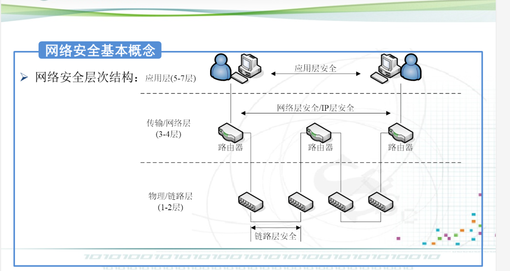

# 网络安全现状

# 网络安全基本概念

## 安全的含义：

## 网络安全的定义：

​		网络安全指网络系统的软件、硬件以及系统中存储和传输的数据收到保护，不因偶然的或者恶意的原因而遭到破坏、更改、泄露，网络系统连续可靠正常的运行，网络服务不中断。

## 三种基本属性：

- ### 机密性

- ### 完整性

- ### 可用性

## 密码系统模型

## 扩展属性

- ### 可控性

- ### 真实性

- ### 不可否认性

- ### 可审查性

## 网络安全目标

访问控制、授权、加密、数据完整性鉴别、审计监控防抵赖

## 网络安全的层次结构

### TCP/IP技术层次分析

# 网络安全技术与管理

## 三分技术，七分管理

