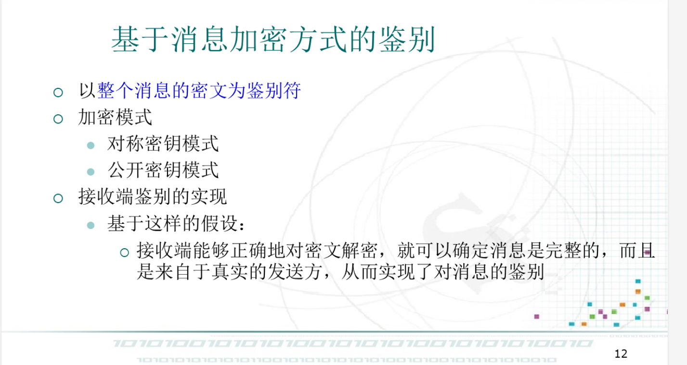
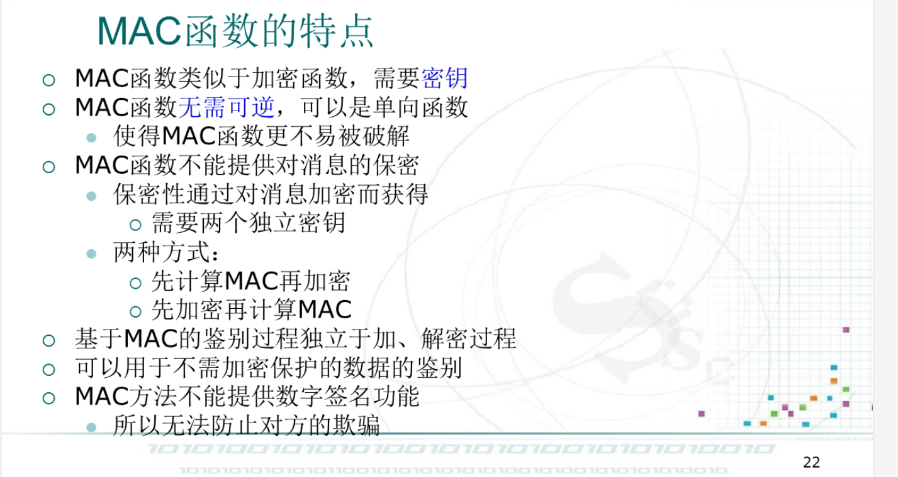

# 消息鉴别

消息认证、报文认证、报文鉴别

## 鉴别

消息接收者对消息进行的验证，是一个证实收到的消息来着可信的原点且未被篡改的过程。

- 真实性：消息确实来自于真正的发送者，而非假冒
- 完整性：消息内容没有被篡改、重放或延迟

## 消息鉴别的必要性

### 网络通信的安全威胁

### 消息鉴别的作用

## 鉴别系统的模型

## 消息鉴别系统的分类

### 基于消息加密方式的鉴别

### 基于MAC的鉴别

### 基于Hash函数的鉴别

## 消息鉴别的应用

## Hash函数的安全性需求

# 数字签名

## 数字签名的概念

## 数字签名满足的条件

## 数字签名应具有的性质

## 设计要求

## 数字签名方案的组成

## 基本原理

## 数字签名设计方案

### 直接数字签名

### 基于仲裁的数字签名

