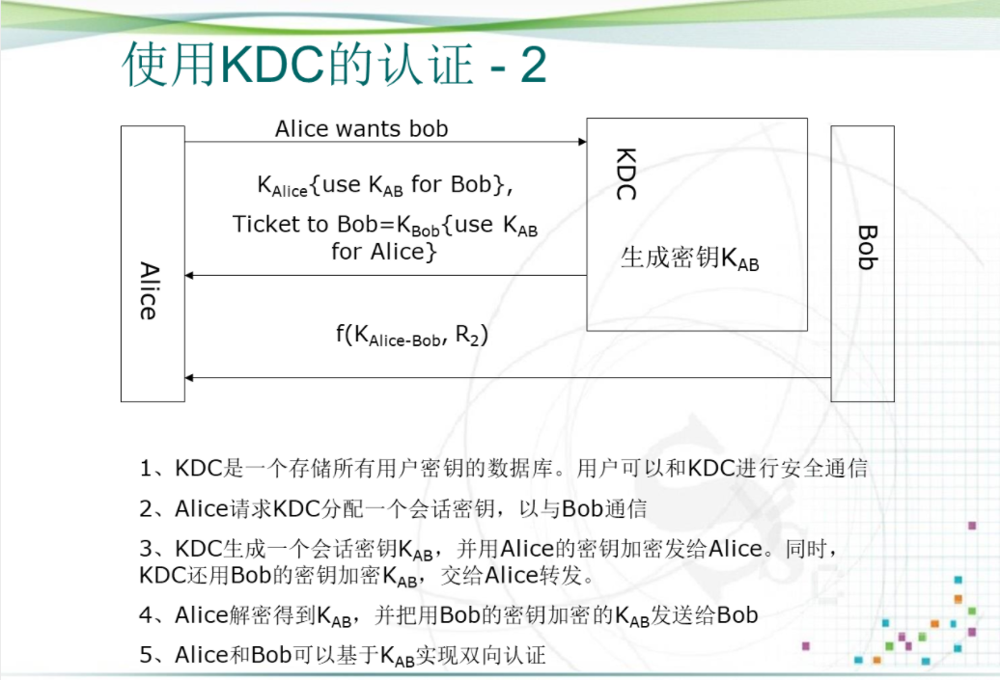

# 身份认证

## 概念

## 功能

## 分类

# 认证人的身份

## 用户认证

## 用户认证的依据

### 静态口令

### 动态口令

### IC卡认证

### USB Key认证

### 生物特征认证

### 特点比较

# 安全握手协议的基本思想

## 网络环境中的认证

## 单向认证

## 双向认证

## 使用KDC的认证

# Kerberos认证协议

