**课本第八章**

# 基本内容

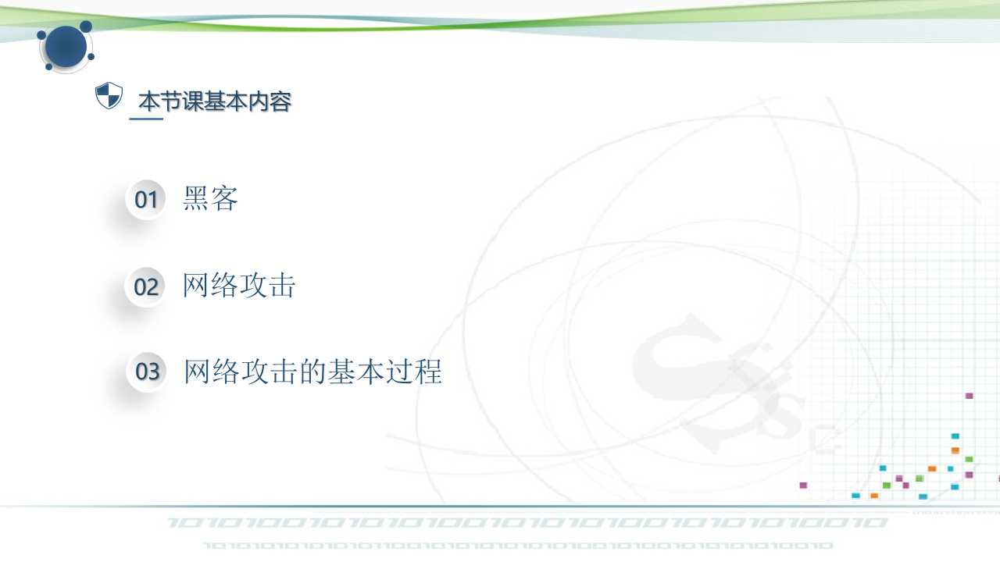

# 教学目标

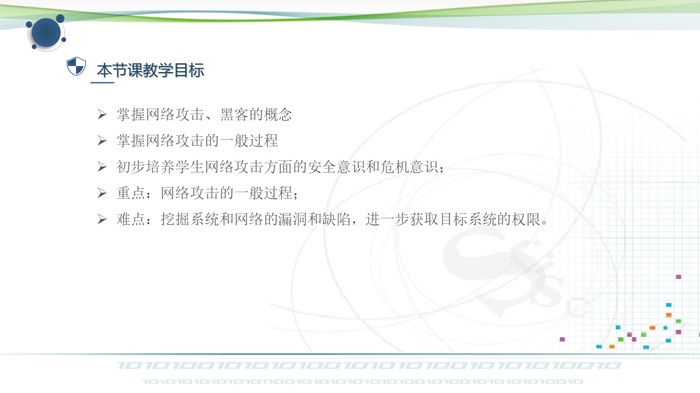

# 课题导入

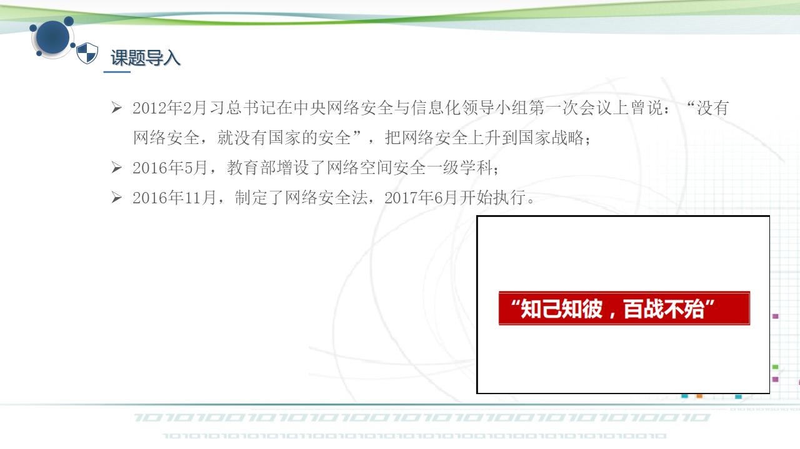

# 网络攻击

- 概念：任何非授权的情况下，试图存取信息、处理信息或破坏网络系统以使系统不可靠、不可用的故意行为都被称为网络攻击。**入侵伴随着攻击，攻击成功的结果就是入侵。**

- 攻击对象：网络
- 结果：入侵型攻击、破坏型攻击
- 范围：整个网络、系统、主机、服务器、设备等等
- 常见的攻击手段：冒充、重放、篡改、拒绝服务、内部攻击、外部攻击、恶意代码
- 常见的攻击类型：暴力破解、拒绝服务攻击、缓冲区溢出攻击、社会工程

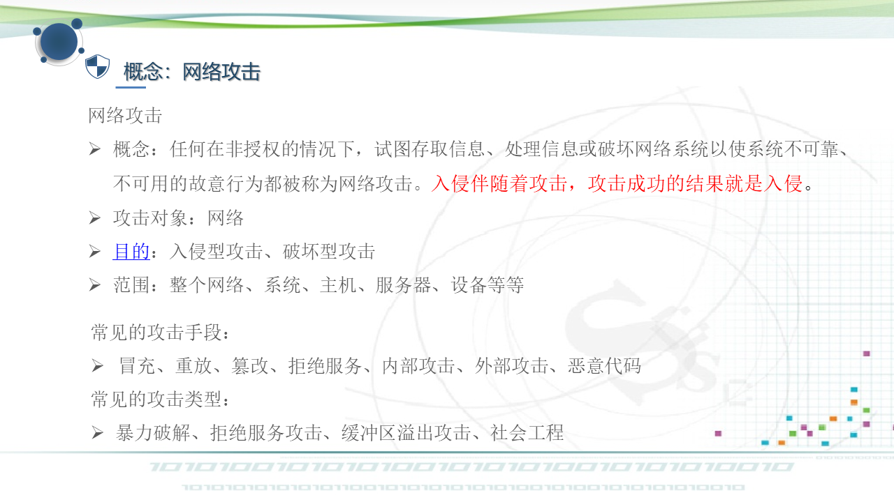

## 网络攻击的目的

- 获取超级用户权限，对系统的非法访问。

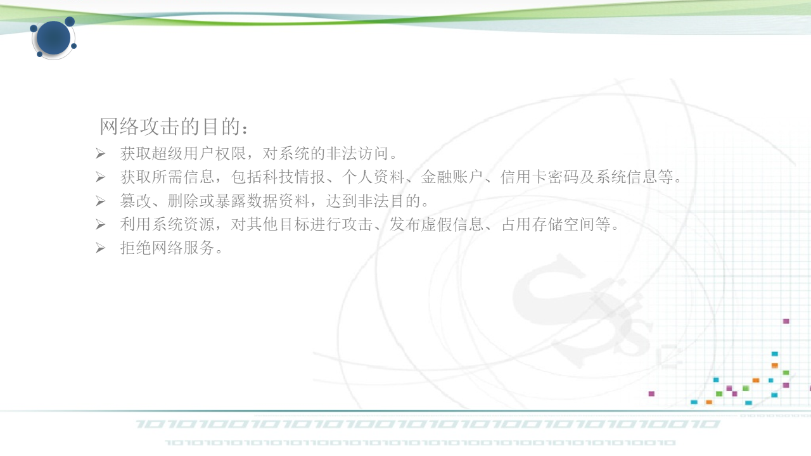

# 网络攻击的整体模型描述

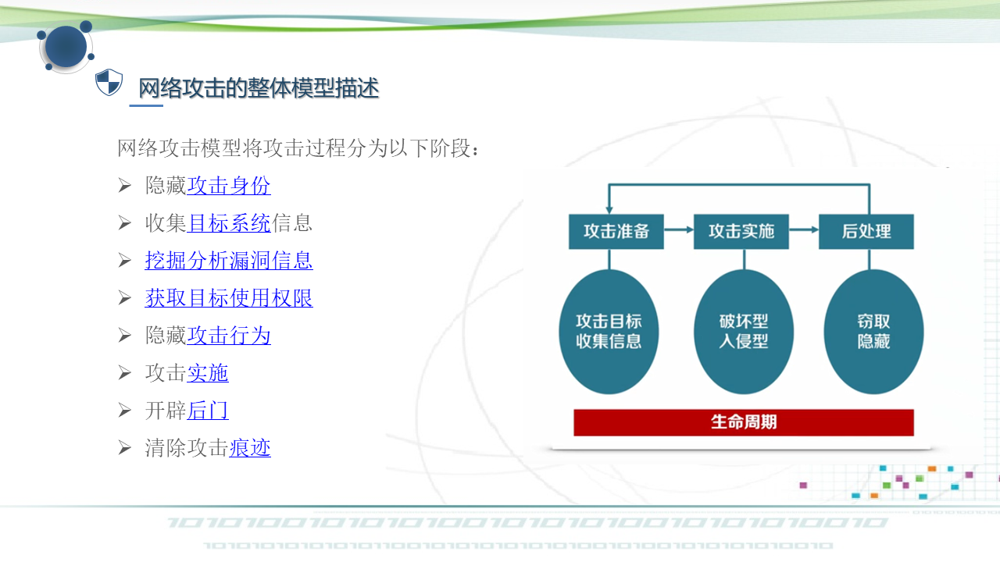

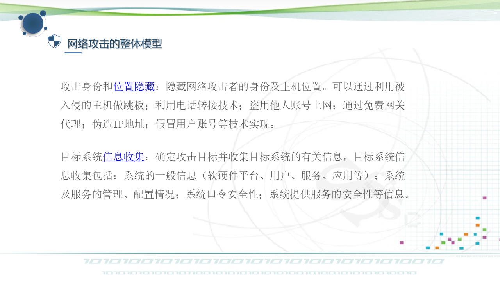

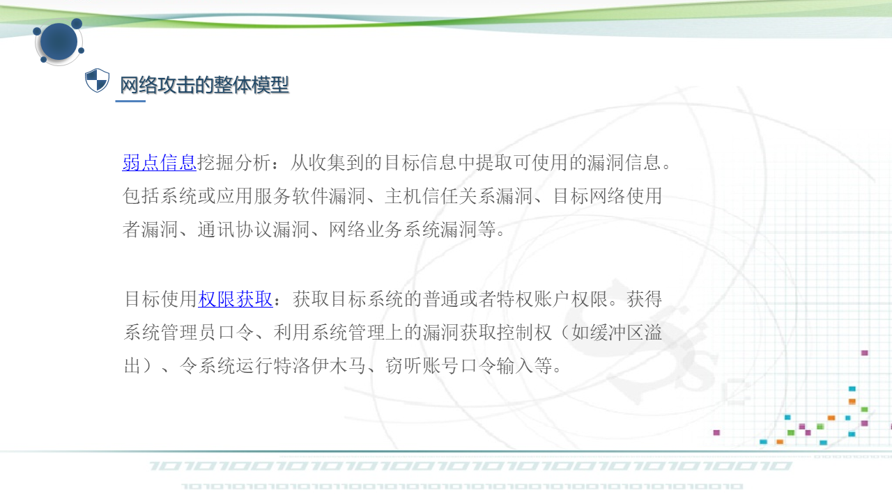

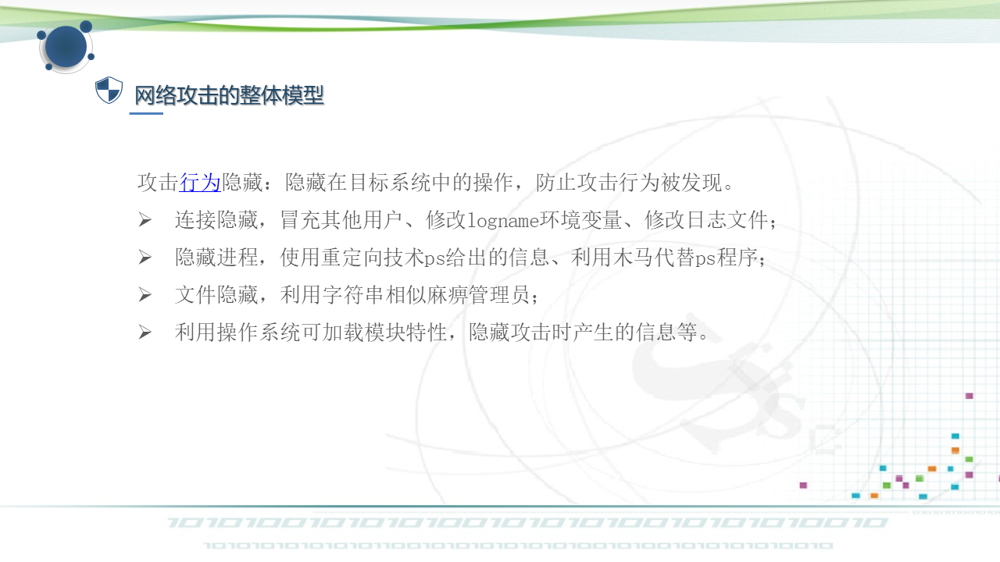

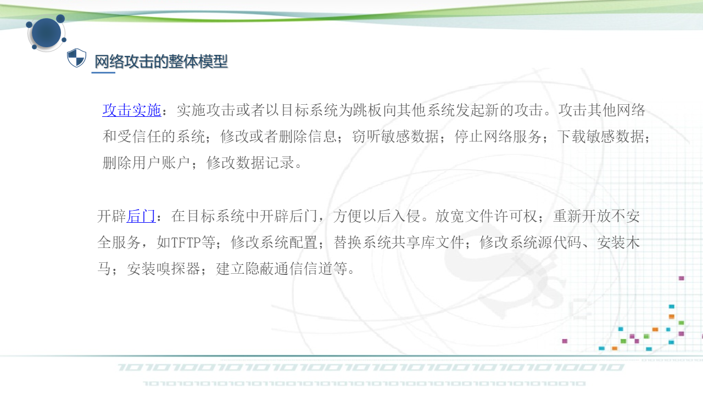

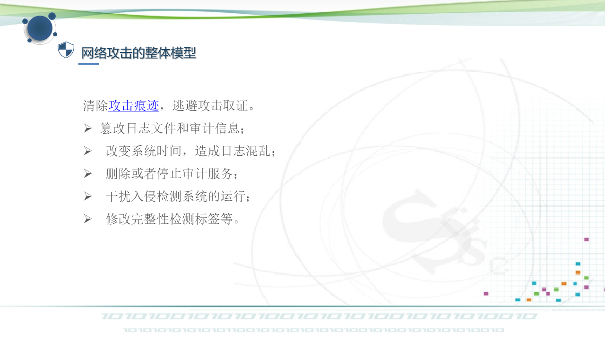

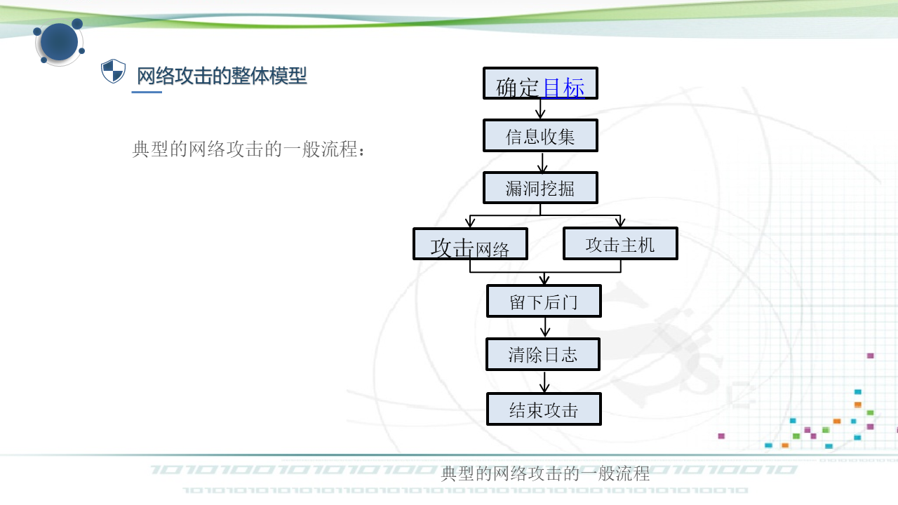

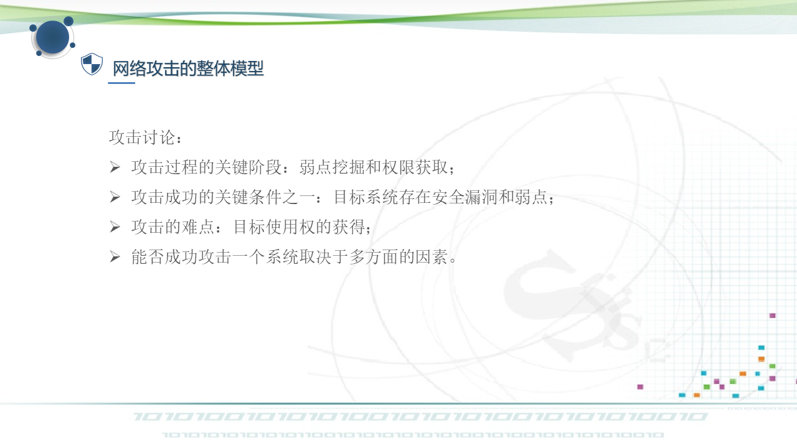

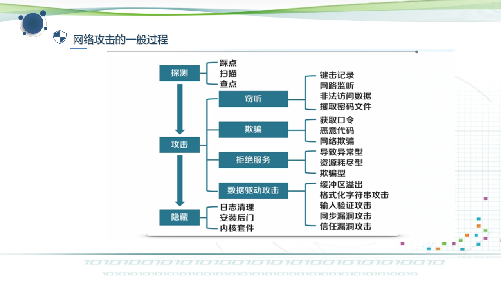

