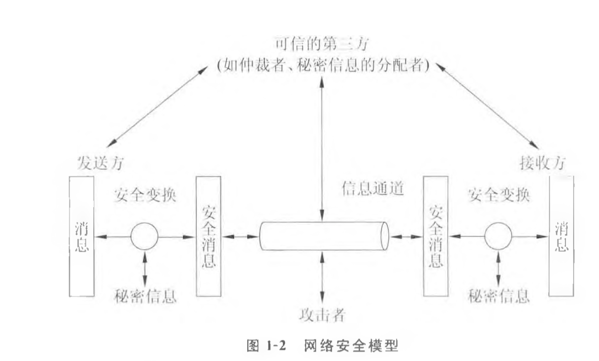
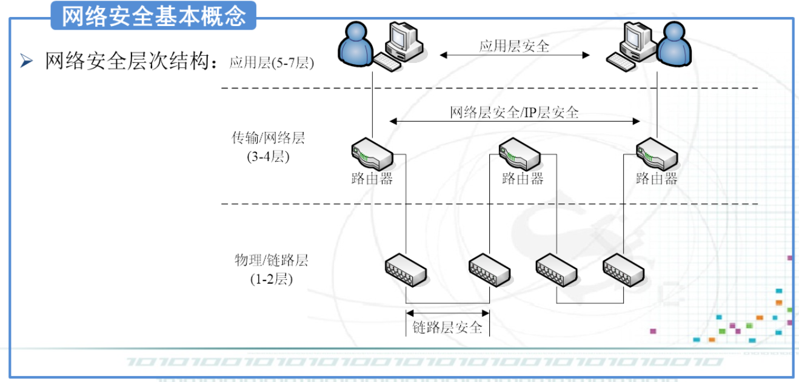
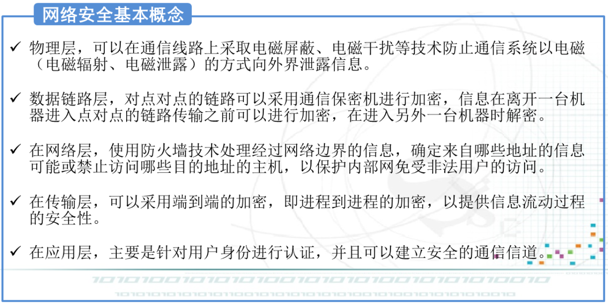
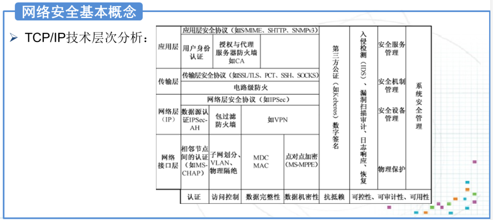

# 第一二章 安全概述和安全模型：

## 1、计算机网络安全的概念、网络安全属性及其含义

### 定义

网络安全指网络系统中的软件、硬件以及系统中存储和传输的数据受到保护，不因偶然的或者恶意的原因而遭到破坏、更改、泄露，网络系统连续可靠正常的运行，网络服务不中断。

### 三种基本属性：机密性、完整性、可用性

- 机密性：是指保证信息不泄露给未授权用户的能力，几遍

## 2、网络安全模型

## 3、OSI安全体系结构，安全攻击、安全服务和安全机制。

# 第三章 消息鉴别：

## 1、数字签名的概念及数字签名原理，基于公钥密码的数字签名原理；

## 2、消息鉴别函数

## 3、消息鉴别码

# 第四章身份认证：

## 1、CA的基本职责包括哪些；证书的概念及基本功能；

## 2、双向认证，其认证和分发密钥的过程；

## 3、kerberos认证

# 第五章Internet安全：

## 1、IP安全：提供哪些服务，AH和ESP分别提供哪些服务，掌握IPSec的两种工作模式，区别，并举例。

## 2、SSL（安全套阶层协议）：

## 3、PGP 

# 第七章：防火墙

## 1、防火墙的概念及功能；

## 2、简述包过滤原理；状态监测技术具有哪些特点，代理防火墙、NAT；

## 3、防火墙配置，体系结构。

# 第八章：网络攻击与入侵检测

## 1、常见的几种拒绝服务攻击原理；入侵检测的概念及过程、功能；

## 2、异常检测和误用检测；

## 3、分布式入侵检测

# 第九章：VPN

## 1、VPN， VPN的基本类型，主要应用场景是什么；

## 2、VPN每层的代表协议？

## 3、SSL VPN关键技术；

# 第十章：无线网络安全

## 无线局域网IEEE802.11i特有的特点、安全威胁；协议结构

# 第十一章：移动互联网安全3GPP

# 以上是部分重要的内容，重点章节是3、4、5、