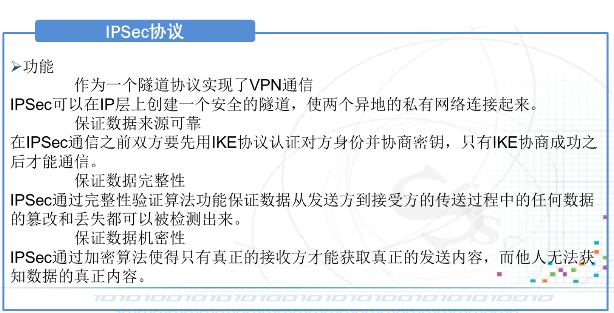
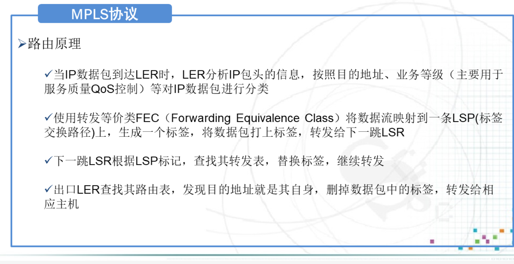
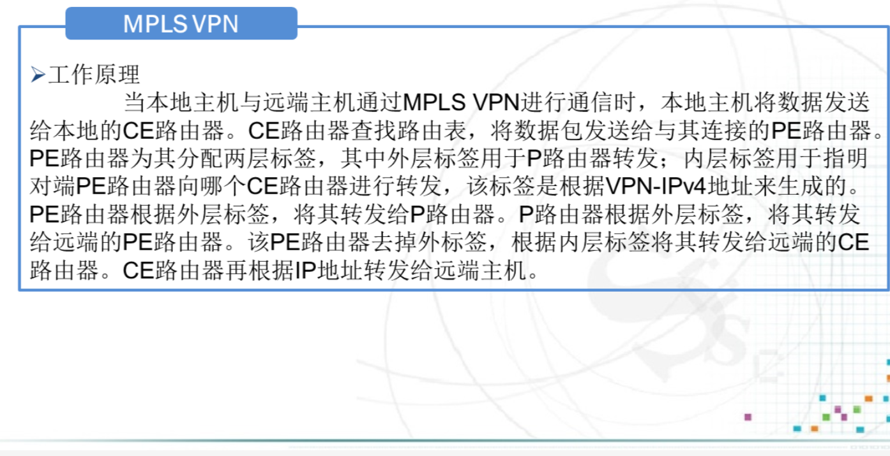
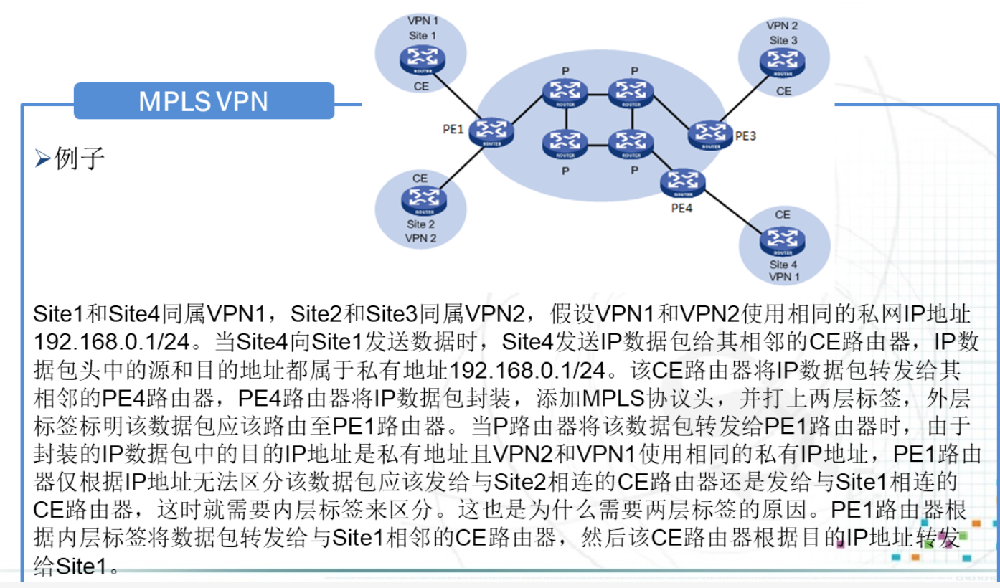

# VPN基本概念

## VPN

## VPN工作原理

## VPN分类

# IPSec协议

## 基本概念

### 由来

### 功能

### 体系结构

- AH
- ESP
- IKE

## IPSec协议框架

### 加密算法

### 报文摘要算法

### 认证----身份识别

#### PSK认证

#### RSA数字签名认证

### 密钥分发协议

### Internet密钥交换协议

## 认证头(AH)&封装安全载荷(ESP)

### 认证头(AH)

### 封装安全载荷(ESP)

## Internet密钥交换协议(IKE)

### 发送端启动IKE过程

### IKE建立安全关联SA的过程

### IKE相关策略配置举例

### IKE的2个协商阶段

#### IKE阶段1主模式

##### 1、协商策略

##### 2、建立DH密钥

##### 3、双向身份认证

#### IKE阶段2：快速模式

# TLS协议

## TLS的产生原因和发展过程

## TLS协议结构

## TLS记录协议工作流程

## TLS记录协议报文格式

## TLS实例实现过程

# HTTPs:基于TLS的HTTP

## 操作过程

# PGP和S/MIME

## PGP发送端处理过程

## PGP接收端处理过程

## SMTP邮件格式

## MIME邮件格式

## SMTP和MIME的关系

# 课后题(P148手写)

# GRE协议

## GRE协议

## GRE VPN

# MPLS协议

## MPLS协议

## MPLS VPN

### 几个术语

### 工作原理

### 例子

