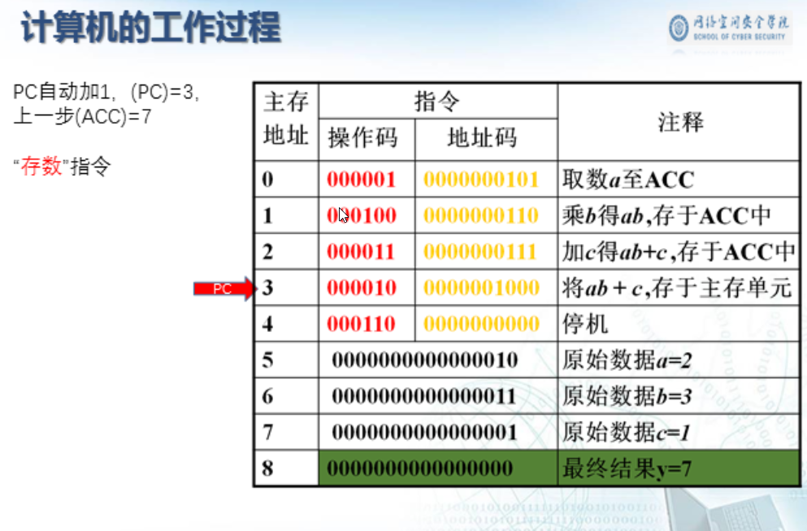
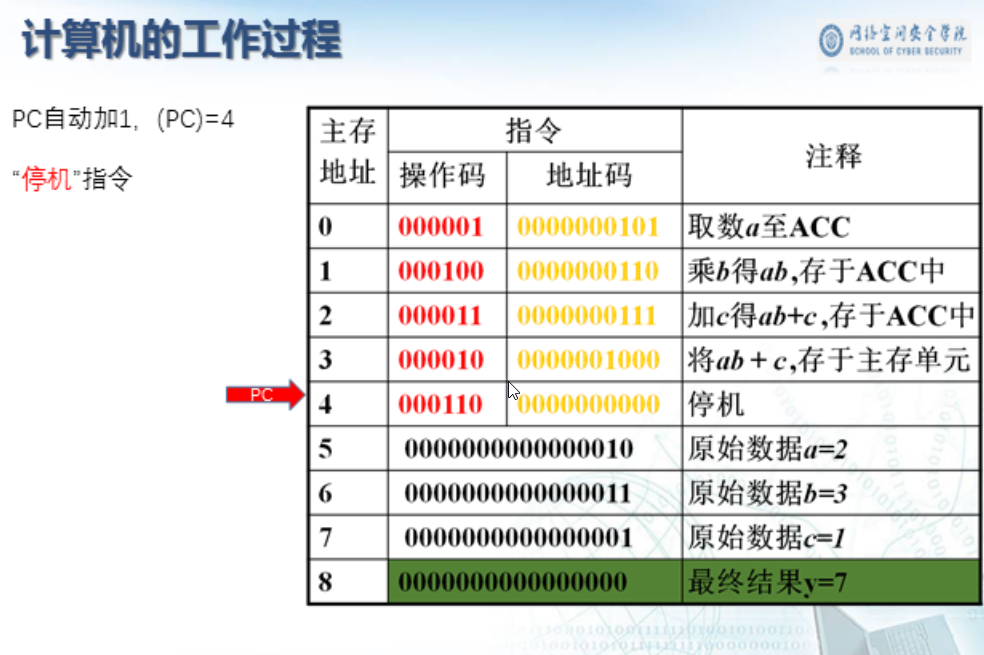

学习内容和目标

第一篇 概论

第二篇 计算机系统的硬件结构

第三篇 CPU

第四篇 CU

# 第1章 计算机系统概论

计算机是什么？

**信息就是位(比特、bit)+上下文**

## 计算机系统漫游

## 计算机的软硬件概念

硬件：计算机的实体，如主机、外设等

​		**——是指构成计算机系统的实体和装置之类的有形设备，是组成计算机系统的物质基础。**

软件：由具有各类特殊功能的信息(程序)组成

​		**——是指由硬件所表达的各种内在信息，包括数据与控制程序。因为它们是无形的东西，所以称为软件。**

## 计算机系统的多级层次结构

### 计算机解题过程

#### 程序员角度

### 计算机体系结构与计算机组成

## 计算机硬件的基本组成

**五大部件**：**输入设备、输出设备、存储器、运算器、控制器**

### 冯·诺依曼结构

**早期冯·诺依曼计算机**

#### 冯·诺依曼计算机的特点

1.  **计算机有五大部件组成**
2. **指令和数据一同等地位存于存储器，可按地址寻访**
3. **指令和数据用二进制表示**
4. **指令由操作码和地址码组成**
5. **存储程序**
6. **以运算器为中心**

### 现代计算机结构

#### 现代计算机硬件框图

## 知识回顾

## 各个硬件的工作原理

### 主存储器

### 运算器的基本组成

### 控制器

#### 控制器的基本组成

###### CU：控制单元

###### IR：指令寄存器

###### PC：程序计数器

#### 控制器的功能

### 指令格式举例

## 计算机的工作过程

### 主机完成一条指令的过程

## 计算机硬件系统的组成

## 知识回顾

## 计算机硬件的主要技术指标

### 1.机器字长

CPU一次能处理数据的位数，与CPU中的**寄存器位数**有关

### 2.运算速度

#### 主频

#### 吉普森法$T_M=\sum_{i=1}^{n}{f_it_i}$

#### MIPS 每秒执行百万条指令

#### CPI 执行一条指令所需要时钟周期数

#### FLOPS 每秒浮点运算次数

### 3.存储容量 存放二进制信息的总位数

## 计算机的基本概念

# 第2章 数据的信息表示

## 数的定点与浮点表示

### 1.定点数的表示

#### ①带符号的定点小数

#### ②带符号的定点整数

#### ③无符号定点整数

### 2.浮点数据的表示

#### ①浮点表示中，小数点的位置可以按需浮动

#### ②引入浮点数表示的意义

#### ③浮点数的机器（存储）格式

#### ④位数M的规格化表示

### 3.IEEE754格式的浮点数

#### ① 32位短浮点数

#### ②64位长浮点数

#### 补充说明

#### float型与真值之间的转换

##### 例题1

