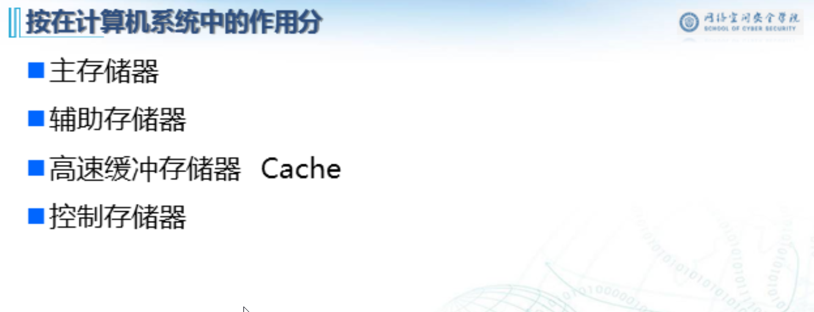
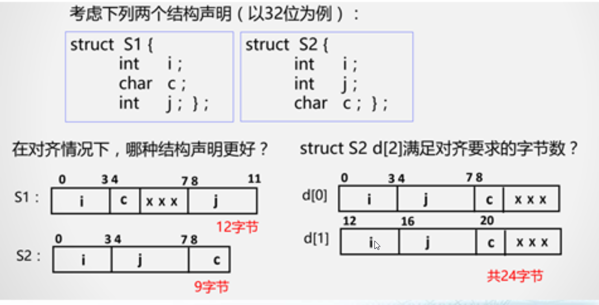
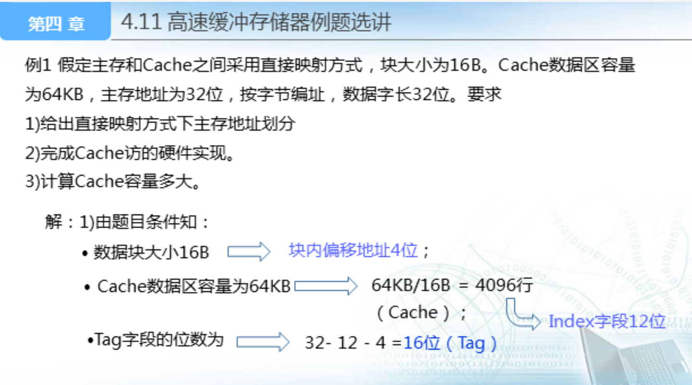

本章主要内容

# 存储器概述

## 存储器分类

### 按存储介质分

#### 1、**半导体存储器**

**双极型存储器 MOS存储器**

**特点：速度快、功耗低**

#### 2、**磁存储器**

**磁芯、磁带、磁盘**

**特点：容量大，速度慢，体积大**

#### 3、**激光存储器**

**CD-ROM、CD-RW、CD-R**

**DVD-ROM、DVD-RW、DVD-R**

**特点：便于携带，廉价，易于保存**

### 按存取方式分

#### 1、**随机存储器**

存取时间与物理位置 无关

磁芯、半导体存储器

#### 2、**顺序存储器**

存取时间与物理位置有关

磁盘、磁带、激光存储器

#### 3、**相联存储器**

既可以按内容访问的存储器，又可以按照内容检索到存储位置进行读写

“快表”就是一种相联存储器。

#### 4、**直接存储器**

既有随机存取特性，也有顺序存储特性，先直接选取信息所在区域，然后按顺序方式存取。

#### 5、串行访问存储器

读写某个存储单元所需时间与存储单元的物理位置有关

### 按读/写功能分

#### 只读存储器（ROM）

存储器内容是预置的，固定的，无法改写的

#### 读／写存储器

既能读出也能写入的存储器

随机存储器**RAM**

### 按信息的可保存性分

#### 易失性存储器（Volatile Memories）

断电后信息消失

静态RAM（SRAM）

动态RAM（DRAM）

#### 非易失性存储器（Non-Volatile Memories）

断电后仍能保存信息

磁存储器、激光存储器、NVRAM

### 按在计算机系统中的作用分

#### 主存储器

#### 辅助存储器

#### 高速缓冲存储器 Cache

#### 控制存储器

### 存储器分类小结

## 冯诺依曼结构

## 存储系统层次结构

### 存在的问题

#### 速度

#### 容量

#### 价格

**主存增速与CPU增速不同步**

**指令执行期间多次访问存储器**

### 层次结构

## 局部性原理

### 时间局部性

现在访问的信息在不就的将来还将再次被访问；

时间局部性的程序结构体现：**循环结构**

### 空间局部性

现访问的信息2，下一次访问2附近的信息。

空间局部性的程序结构体现：顺序结构

### 例子

## 存储系统的主要指标

### 存储时间

接收到读写命令到从存储器中读出或写入信息所经历的时间

### 存储周期

连续两次访问存储器所需要的最小时间间隔

### 存储器带宽

单位时间内存储器存取的信息量

Byte/s

# 主存储器

## 基本概念

## 基本术语

## 主存储器特征

- 由半导体MOS存储器组成
- 存储单元：字存储单元，字节存储单元
- 按地址进行访问：字地址，字节地址
- 属于随机访问存储器
- 主存空间包含读/写存储空间内和只读存储空间

## 译码器

输入为数字量（即地址），根据输入的数字量在多个输出端中选一个有效

## 主存的基本结构和工作原理

## 主存中的数据组织

### 一、存储字长

- 主存的一个存储单元所包含的二进制的位数；
- 目前大多数计算机的主存按字节编址，存储字长也不断加大，如16位字长、32位字长和64位字长；
- ISA设计时要考虑的两个问题： 
- - a)如何根据字节地址读取一个32位的字？---**字的存放问题**
  - b)一个字能否存放在主存的任何字节边界》---**字的边界对齐问题**

### 二、数据存储与边界的关系

#### 1、按边界对齐的数据存储

#### 2、未按边界对齐的数据存储

#### 3、边界对齐与存储地址的关系（以32位为例）

### 三、大端与小段存储方式(Big-Endian、Little-Endian)

大端：起始地址（即数据地址）存放数据的高位字节

小端：起始地址（即数据地址）存放数据的低位字节

#### 例子

# 主存储器和CPU的连接

## 半导体存储器的设计

## 半导体存储器的逻辑设计

## 主存储器与CPU的连接

### 存储器扩展

256K*8表示含义：256K个存储单元，每个单元是1位

256K=2^18 bit 18根地址线

### 例子：

#### 位扩展

并行连接，同一地址信号，不同芯片输出不同数据

#### 字扩展

片选信号(CS)选择哪一个存储单元

全译码器

部分译码

### 各芯片地址范围

### 综合扩展

# 高速存储器解决之道

## 双端口存储器

不可能达到两倍读写速度，会发生冲突

## 单体多字存储器

## 多体交叉存储器

# Cache的基本原理

## 存储系统中的Cache视图

多个字组成一个块，以块为单位进行数据交换

## Cache的工作过程

## Cache地址映射机制

## Cache的结构

## Cache的命中率

## 主存-Cache系统的效率

### 例题

# 相联存储器

## 相联存储器的作用

## 判断的基本思路

## 相联存储器的基本结构及工作原理

## 相联存储器的一种技术实现

# Cache地址映射与变换方法

## 全相联映射的工作原理

### 特点

## 直接映射的工作原理

### 特点

## 组相联映射的工作原理

### 特点

## 例题

## 例题2

# 替换算法

## 需要替换算法的原因

## 几种常见的替换算法

## 替换算法FIFO(先入先出)

## 替换算法LFU(最不经常使用)

## 替换算法LRU(最近最久未使用)

## 替换算法的抖动

## 替换算法的实现方式

# 虚拟存储器

## 虚拟存储器概述

## 虚拟存储器技术必须解决的问题

## 虚拟存储器地址划分

## 逻辑地址与物理地址的转换

# TLB(Translation Lookaside Buffer)

## 虚拟地址转换过程中存在的问题

## TLB的工作原理

# 虚拟存储与Cache的比较

## 相同

## 不同

# 辅助存储器

## 一、概述

## 二、磁记录原理和记录方式

## 三、硬磁盘存储器

# RAID

