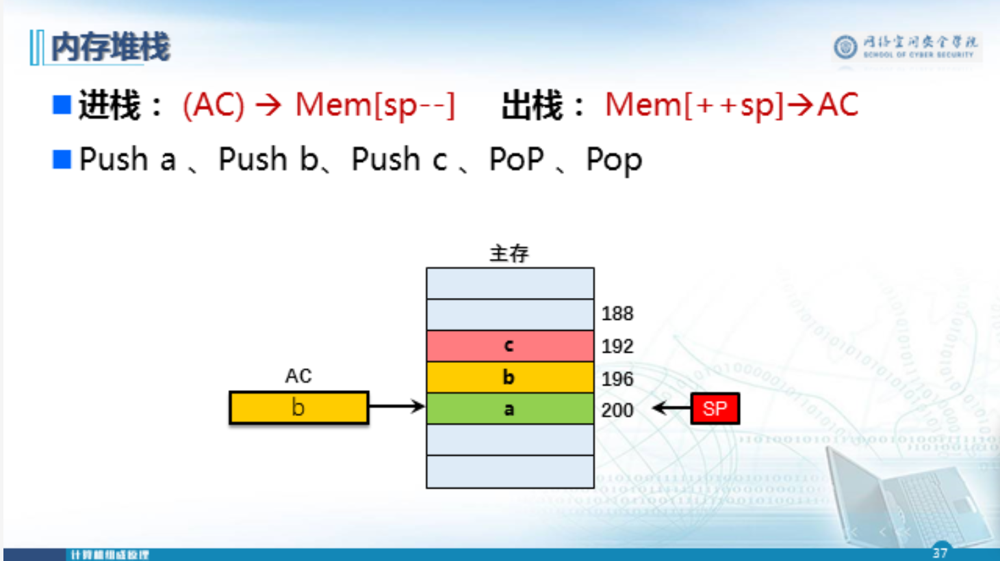
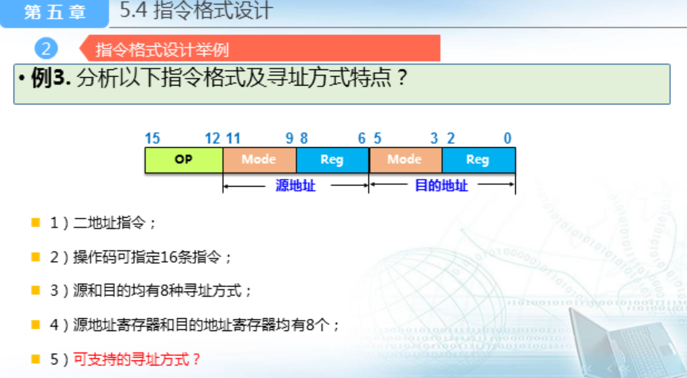

# 指令系统的基本概念

## 机器指令、指令系统

## 指令字长

## 计算机指令系统层次

## 指令系统设计的基本要求

- 完备性
- 有效性
- 规整性
  - 对称性
  - 匀齐性
  - 一致性
- 兼容性

# 指令格式

## 指令格式

## 操作码与地址码

## 1、按照操作码长度是否可变

扩展指令举例

## 2、根据操作数地址码字段的个数分类

## 3、根据指令中操作数的物理地址分类

## 4、根据指令功能

# 5.3寻址方式

## 1、寻址方式的概念

## 2、指令的寻址方式

### 顺序寻址

### 跳跃寻址

## 3、操作数的寻址方式

### 立即寻址

### 直接寻址

### 间接寻址

### 寄存器间接寻址

### 相对寻址

### 基址寻址

### 堆栈寻址方式

#### 硬件堆栈

#### 内存堆栈

### 复合寻址

## 不同寻址方式对比

## 总结

### 寻址方式

### 寻址方式举例

### 指令格式和寻址方式举例

# 5.4指令格式设计

## 1、指令格式设计的主要内容

## 2、指令格式设计举例

## CISC和RISC的基本概念

### 一、RISC的产生和发展

### 二、RISC的主要特征

### 三、CISC的主要特征

### 四、RISC和CISC的比较

