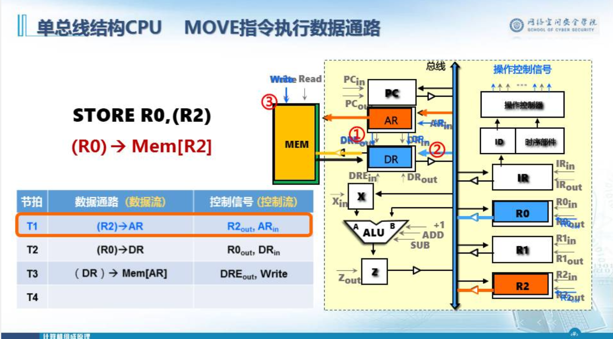
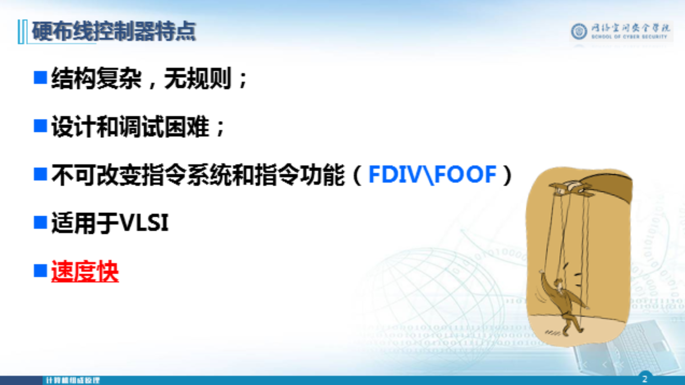
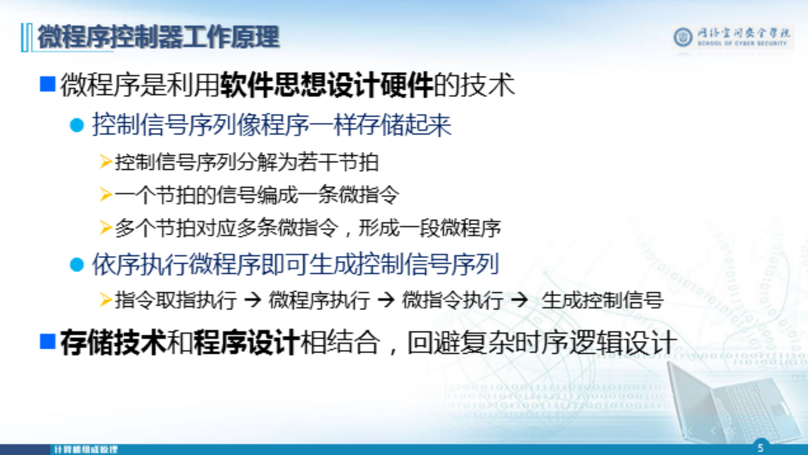

# CPU概述

## CPU基本组成

## CPU的主要功能

## CPU中主要寄存器

# 数据通路

## 数据通路抽象模型

## D触发器定时模型

## 数据通路与时钟周期

## 数据通路分类

# 指令周期与时序

## 指令执行一般流程

## 指令周期基本概念

## 指令周期同步

### 早期三级时序系统

### 时序产生器与控制器

# 时序产生器设计

Rt----->target

Rd---->Destation

