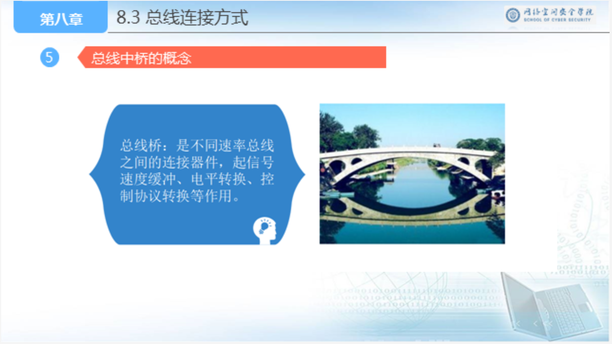

# 8.1 总线的基本概念

## 1、总线的概念

## 2、总线的作用

## 3、总线的分类

- 按位置分
- 按总线数量分
- 按传输方向分
- 按传输速度分
- 按时序控制分

### 按用途分类

## 4、总线的组成

# 8.2 总线性能和总线事物

## 1、总线的性能参数

## 2、

## 3、

## 4、

## 5、

## 6、

# 8.3 总线的连接方式

# 8.4

# 8.5

